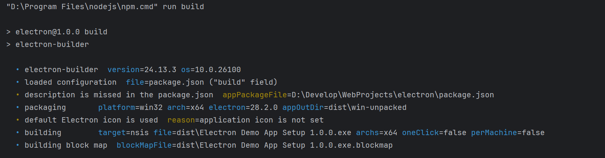
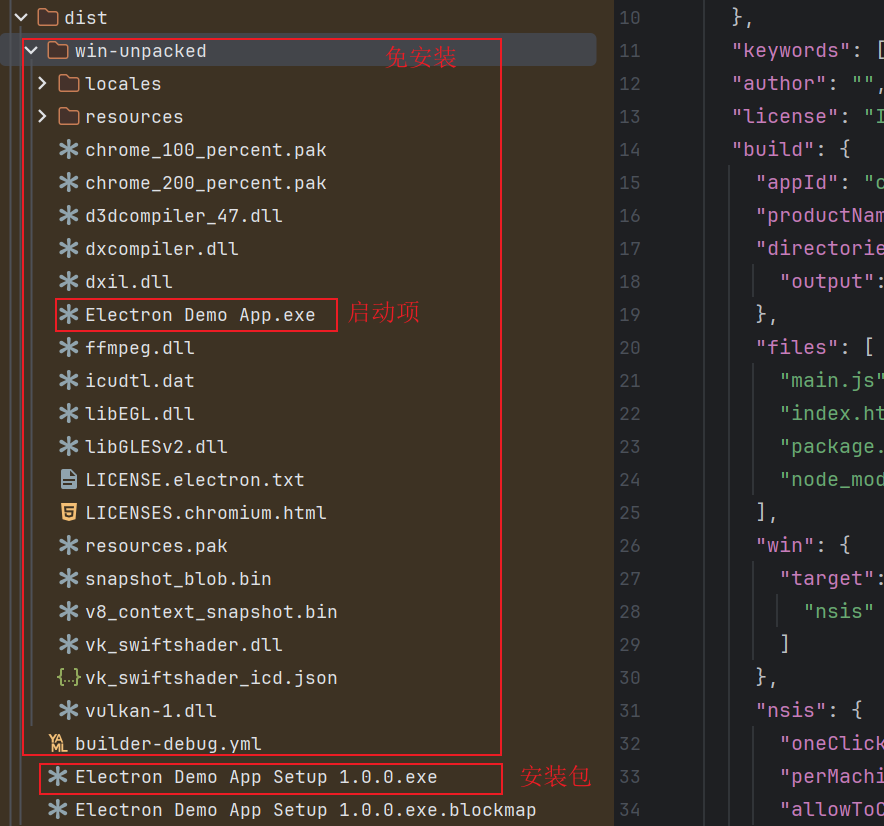
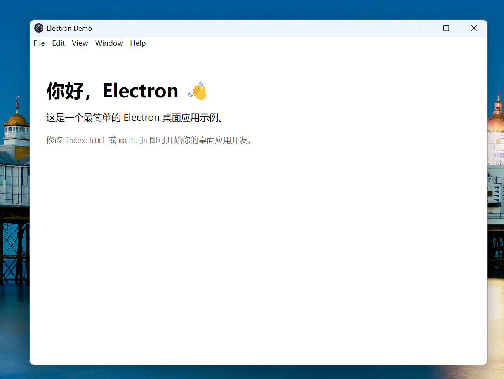
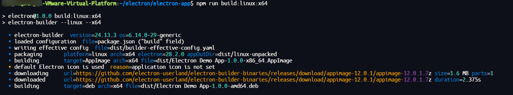
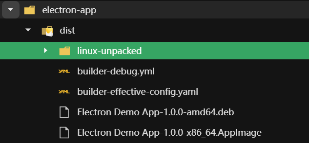
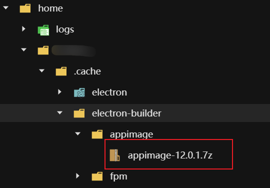

# 从 Windows 到 Linux（ARM/AMD）全平台打包的完整 Electron 教程

> 本文是一份 **完整、可落地、跨平台（Windows + Linux x64 + Linux ARM）** 的 Electron 应用创建 & 打包指南。
>
> 从零创建 Electron 项目 → 本地运行 → Windows 打包 → Linux x64/ARM 架构打包 → 全流程一文搞定。

适合：

- 初学 Electron，希望快速入门的同学
- 想将项目发布到多个平台
- 想支持树莓派（ARM）或 ARM 服务器的开发者

## 一、环境准备

无论 Windows 还是 Linux，你需要：

- **Node.js**（建议 22+）
- **npm**（随 Node 自带）
- **electron**
- electron-builder

检查版本：

```bash
C:\Windows\System32>node -v
v22.21.1

C:\Windows\System32>npm -v
10.9.4
```

如果你要打包 **Linux ARM**（树莓派等），建议在目标 ARM 机器上进行构建（成功率最高）。

## 二、新建 Electron 项目（从零开始）

### 1.确定项目目录

比如，我们把 Electron 项目放在：

```bash
D:\Develop\WebProjects
```

### 2.初始化项目（生成 package.json）：
在命令行执行：
```bash
cd D:\Develop\WebProjects
mkdir electron
cd electron

npm init -y
```
执行完后，当前目录下会多出一个 package.json 文件，用来描述项目的依赖、脚本、元信息等。

### 3.安装核心依赖

建议使用如下版本，已经经过（**window/Linux**）打包测试

```bash
# Electron 运行时
npm install electron@28.2.0 --save-dev

# 打包工具：electron-builder
npm install electron-builder@24.13.3 --save-dev
```
此时 package.json 里会多出这两个依赖。

## 三、编写最小可运行的 Electron 应用
Electron 至少需要两个东西：

1. 一个 **主进程脚本**（例如 `main.js`）
2. 一个 **渲染进程页面**（例如 `index.html`）

在 electron-app 下这样安排：
```
electron-app
├─ package.json
├─ main.js              # Electron 主进程
├─ preload.js           # 可选：渲染进程桥接用
├─ index.html        # 渲染进程的简单页面
```

### 1.创建主进程入口文件 main.js

在 `electron-app` 目录下，新建 `main.js`，内容如下：

```javascript
// main.js
const { app, BrowserWindow } = require('electron');
const path = require('path');

// 创建主窗口
function createWindow() {
  const win = new BrowserWindow({
    width: 800,
    height: 600,
    webPreferences: {
      // 可以按需要配置，如禁用 nodeIntegration 提升安全性
      nodeIntegration: true,
      contextIsolation: false
    }
  });

  // 加载本地 HTML 文件
  win.loadFile(path.join(__dirname, 'index.html'));

  // 打开开发者工具（开发阶段可打开，打包前可以注释）
  // win.webContents.openDevTools();
}

// Electron 初始化完成后创建窗口
app.whenReady().then(() => {
  createWindow();

  app.on('activate', () => {
    // macOS 上常见行为：没有窗口时点击 Dock 图标重新创建
    if (BrowserWindow.getAllWindows().length === 0) {
      createWindow();
    }
  });
});

// 所有窗口关闭时退出应用（macOS 上习惯不同，这里是 Windows 为主）
app.on('window-all-closed', () => {
  if (process.platform !== 'darwin') {
    app.quit();
  }
});
```

### 2. 创建渲染页面 index.html

在同一目录下，新建 `index.html`：

```html
<!DOCTYPE html>
<html lang="zh-CN">
<head>
  <meta charset="UTF-8" />
  <title>Electron Demo</title>
  <style>
    body {
      font-family: system-ui, -apple-system, BlinkMacSystemFont, "Segoe UI", sans-serif;
      padding: 20px;
    }
    h1 {
      margin-bottom: 10px;
    }
    .tip {
      color: #666;
      margin-top: 20px;
      font-size: 14px;
    }
  </style>
</head>
<body>
  <h1>你好，Electron 👋</h1>
  <p>这是一个最简单的 Electron 桌面应用示例。</p>

  <div class="tip">
    修改 <code>index.html</code> 或 <code>main.js</code> 即可开始你的桌面应用开发。
  </div>
</body>
</html>
```

### 3. 修改 package.json，加入启动脚本

打开 `package.json`，做两处修改：

1. 指定入口文件 `"main": "main.js"`
2. 增加一个 `start` 脚本，方便开发时启动

示例（只展示关键部分）：

```json
{
  "name": "electron",
  "version": "1.0.0",
  "description": "My first Electron app",
  "main": "main.js",
  "scripts": {
    "start": "electron ."
  },
  "devDependencies": {
    "electron": "28.2.0",
    "electron-builder": "24.13.3"
  }
}
```

> 版本号以实际安装为准，不需要刻意对齐上面的数字。

### 4. 运行开发环境

在项目根目录执行：

```bash
npm start
```

如果一切正常，会弹出一个 800×600 的窗口，显示你刚才写的 `index.html` 内容，这说明你的 Electron 项目已经 **跑起来了**。🎉🎉🎉

## 四、Windows 平台打包（生成 .exe 安装包）

### 1. 配置 electron-builder 打包

下面的目标是：

> 一条命令，把当前 Electron 项目打包成 **Windows 安装包/可执行文件**。

### 2. 在 package.json 中添加打包脚本

继续编辑 `package.json`，在 `scripts` 里加入一个 `build` 命令：

```json
"scripts": {
  "start": "electron .",
  "build": "electron-builder"
}
```

### 3. 配置 build 字段（应用信息 & 打包目标）

在 `package.json` 根节点添加一个 `build` 字段，例如：

```json
"build": {
  "appId": "com.example.electronapp",
  "productName": "Electron Demo App",
  "directories": {
    "output": "dist"
  },
  "files": [
    "main.js",
    "index.html",
    "package.json",
    "node_modules/**/*"
  ],
  "win": {
    "target": [
      "nsis"
    ]
  },
  "nsis": {
    "oneClick": false,
    "perMachine": false,
    "allowToChangeInstallationDirectory": true
  }
}
```

说明：

- **appId**：应用唯一 ID，一般建议用反向域名。
- **productName**：生成安装包时显示的应用名称。
- **directories.output**：打包输出目录（例如 `dist` 下）。
- **files**：哪些文件/目录会被打进应用包内。
- **win.target**：指定 Windows 目标格式，比如：
  - `nsis`：常见安装向导（`.exe` 安装器）
  - 也可以用 `portable` 等其他形式
- **nsis**：对安装向导的一些行为配置：
  - `oneClick`: 是否一键安装（true 会不显示步骤）
  - `allowToChangeInstallationDirectory`: 是否允许用户修改安装路径

一个更完整一点的 `package.json` 可能是这样（示例）：

```json
{
  "name": "electron",
  "version": "1.0.0",
  "description": "",
  "main": "main.js",
  "scripts": {
    "test": "echo \"Error: no test specified\" && exit 1",
    "start": "electron .",
    "build": "electron-builder"
  },
  "keywords": [],
  "author": "",
  "license": "ISC",
  "build": {
    "appId": "com.example.electronapp",
    "productName": "Electron Demo App",
    "directories": {
      "output": "dist"
    },
    "files": [
      "main.js",
      "index.html",
      "package.json",
      "node_modules/**/*"
    ],
    "win": {
      "target": [
        "nsis"
      ]
    },
    "nsis": {
      "oneClick": false,
      "perMachine": false,
      "allowToChangeInstallationDirectory": true
    }
  },
  "devDependencies": {
    "electron": "^28.2.0",
    "electron-builder": "^24.13.3"
  }
}
```

### 4. 执行打包命令（生成 exe 安装包）

在项目根目录执行：

```bash
npm run build
```



首次打包可能会：

- 下载打包所需的一些额外组件（如 Electron 的二进制）
- 在命令行输出大量日志

如果没有报错，最后你会在项目目录下看到一个 `dist` 目录，里面通常包含：

- `Electron Demo App Setup x.x.x.exe`（安装器）
- 以及一些中间产物、卸载程序等



### 5. 安装 & 运行测试

双击 `dist` 下的安装包（`.exe`），按照安装向导一步一步进行：

1. 选择安装路径
2. 下一步 / 完成
3. 安装完成后桌面会有图标，或者开始菜单里能找到你的程序

打开应用，如果看到的是你在 `index.html` 中写的界面，说明打包成功 ✅。



## 五、在 Linux下打包 Electron

适用于：

- Ubuntu / Debian / Deepin / Mint / CentOS / RHEL 等主流 Linux
- x64 服务器
- 桌面 Linux 系统


- ARM 服务器 / 开发板

这时就需要使用 **electron-builder** 生成 **Linux + ARM** 版本的安装包或可执行文件。

> ⚠️ 小提醒：
>
> - 最稳妥的方式是：在 **Linux ARM 真实机器** 上打包对应架构的包。
> - electron-builder 也支持交叉编译，但环境要求相对苛刻，建议先从“在目标环境上打包”开始。

### 1. Linux 下安装依赖

```bash
# 更新包索引
sudo apt-get update

# 安装基础构建工具（以 Debian / Ubuntu 系为例）
sudo apt-get install -y build-essential libx11-dev libxkbfile-dev libsecret-1-dev
```

这条命令一共安装了四类依赖，它们都是 **Electron 在 Linux 上编译本地模块 / 构建应用** 时所需的基础环境。

#### 1.1 **build-essential**

> 📌 作用：Linux 编译环境基础套件

`build-essential` 是一个“集合包”，里面包含：

| 包名      | 作用                 |
| --------- | -------------------- |
| gcc       | GNU C 编译器         |
| g++       | C++ 编译器           |
| make      | 编译工具             |
| libc6-dev | C 语言标准库开发文件 |
| dpkg-dev  | deb 打包工具链       |

> 为什么 Electron 需要它？

- Electron 底层基于 **Chromium + Node.js**，许多 Node 模块需要编译（如 keytar、node-gyp 模块）。
- electron-builder 打包相关功能也可能需要编译 C/C++ 代码。

> 不安装会怎样？

✔️ 大概率报错：

```
g++: command not found
node-gyp rebuild failed
No C compiler found
```

#### 1.2 **libx11-dev**

> 📌 作用：X11 图形系统开发头文件

Electron 的窗口渲染在 Linux 上依赖 **X11** 或 **Wayland**，而大部分 Electron 打包仍会链接到 X11。

此包包含：

- Xlib 的头文件
- 编译 GUI 程序所需的 `.so` 库

> 为什么 Electron 需要它？

Electron 在 Linux 上创建窗口时需要调用 X11 API，例如：

- 创建窗口
- 处理鼠标/键盘事件
- 与窗口管理器通信

> 不安装会怎样？

✔️ 编译 Node GUI 相关模块时可能报错：

```
fatal error: X11/Xlib.h: No such file or directory
```

#### 1.3 **libxkbfile-dev**

> 📌 作用：键盘映射（keyboard layout）相关开发包

Electron 需要与系统的键盘映射（XKB）进行交互，例如：

- 捕获键盘输入
- 热键处理（accelerators）
- 多语言键盘布局支持

> 为什么 Electron 需要它？

某些 Node 模块（比如 keytar、keyboard-shortcut 相关包、Chromium 内部模块）会依赖 XKB 库。

> 不安装会怎样？

✔️ 可能在编译时报错：

```
fatal error: X11/extensions/XKBrules.h: No such file or directory
```

#### 1.4 **libsecret-1-dev**

> 📌 作用：系统级密码存储库（Keyring）开发包

Electron 应用中常用的 **keytar**（存储 Token、密码）需要这个库：

- GNOME Keyring
- Freedesktop Secret Service
- 系统凭据安全存储

> 为什么 Electron 需要它？

如果你的应用使用：

- 自动登录账号
- 保存 Token
- 保存用户密码
- OAuth 登录信息

Electron 的 `keytar` 模块会调用 `libsecret`。

> 不安装会怎样？

✔️ keytar 模块安装失败：

```
Package libsecret-1 was not found in pkg-config search path
Cannot find -lsecret-1
```

## ⭐ 总结 — 这四个包到底干了什么？

| 包名                | 解决的问题                    | Electron 为什么必须要                 |
| ------------------- | ----------------------------- | ------------------------------------- |
| **build-essential** | C/C++ 编译环境缺失            | 构建 Node 模块、electron-builder 依赖 |
| **libx11-dev**      | 缺少基础 GUI（X11）窗口系统库 | Electron 的窗口渲染所需               |
| **libxkbfile-dev**  | 缺少 XKB 键盘布局库           | 键盘输入、快捷键依赖                  |
| **libsecret-1-dev** | 缺少系统凭据存储库            | keytar 等安全存储依赖                 |

### 2.配置 Linux 打包

在 `package.json` 的 build 中增加：

```json
"linux": {
  "target": ["AppImage", "deb"],
  "category": "Utility",
  "maintainer": "1107239758@qq.com",
  "artifactName": "${productName}-${version}-${arch}.${ext}"
}
```

在 `scripts` 中增加：

```json
"scripts": {
  "start": "electron .",
  // 通用构建（比如默认打 Windows）
  "build": "electron-builder",

 // 针对不同平台 / 架构的快捷命令
  "build:win": "electron-builder --win",
  "build:linux:x64": "electron-builder --linux --x64",
  "build:linux:arm64": "electron-builder --linux --arm64",
  "build:linux:armv7l": "electron-builder --linux --armv7l"
}
```

### 3.打包

```bash
# Windows
npm run build:win

# Linux x64
npm run build:linux:x64

# Linux ARM64
npm run build:linux:arm64

# Linux ARMv7l
npm run build:linux:armv7l
```

> 打包成功如下：

打包失败请看，第8节**常见问题排查**

**在公司内网 / 无法访问 GitHub 的环境下，可以只使用 deb 打包，AppImage 作为可选项。**

在 `package.json` 的 **build** 中**linux**去掉**AppImage**：

```json
"linux": {
  "target": ["deb"],
  "category": "Utility",
  "maintainer": "1107239758@qq.com",
  "artifactName": "${productName}-${version}-${arch}.${ext}"
}
```





首次打包可能会：

- 下载打包所需的一些额外组件（如 Electron 的二进制）
- 在命令行输出大量日志

如果没有报错，最后你会在项目目录下看到一个 `dist` 目录，里面通常包含：

- `Electron Demo App Setup x.x.x.deb`（安装器）
- Electron Demo App-1.0.0-x86_64.AppImage（直接运行程序，类似window上的exe）
- 以及一些中间产物、卸载程序等

### 4.安装测试

#### 4.1方案1 

直接用 `.deb` 安装运行就行

```bash
sudo dpkg -i "Electron Demo App-1.0.0-amd64.deb"
```

#### 4.2方案2

开发/测试阶段最简单的解决方案：禁用 sandbox

> 仅建议在 **开发环境、虚拟机、自己用** 的场景；
>
> 线上给别人用时，最好别这么干（有安全影响）。

```bash
./Electron\ Demo\ App-1.0.0-x86_64.AppImage --no-sandbox
# 或
ELECTRON_DISABLE_SANDBOX=1 ./Electron\ Demo\ App-1.0.0-x86_64.AppImage --no-sandbox
```

## 六、完整**package.json**

```json
{
  "name": "electron",
  "version": "1.0.0",
  "description": "My first Electron demo app",
  "keywords": [],
  "author": "yj",
  "license": "ISC",
  "homepage": "https://example.com/electron-demo",
  "main": "main.js",
  "scripts": {
    "test": "echo \"Error: no test specified\" && exit 1",
    "start": "electron .",
    "build": "electron-builder",
    "build:win": "electron-builder --win",
    "build:linux:x64": "electron-builder --linux --x64",
    "build:linux:arm64": "electron-builder --linux --arm64",
    "build:linux:armv7l": "electron-builder --linux --armv7l"
  },
  "build": {
    "appId": "com.example.electronapp",
    "productName": "Electron Demo App",
    "directories": {
      "output": "dist"
    },
    "files": [
      "main.js",
      "index.html",
      "package.json",
      "node_modules/**/*"
    ],
    "win": {
      "target": [
        "nsis"
      ]
    },
    "nsis": {
      "oneClick": false,
      "perMachine": false,
      "allowToChangeInstallationDirectory": true
    },
    "linux": {
      "target": ["AppImage", "deb"],
      "category": "Utility",
      "maintainer": "1107239758@qq.com",
      "artifactName": "${productName}-${version}-${arch}.${ext}"
    }
  },
  "devDependencies": {
    "electron": "^28.2.0",
    "electron-builder": "^24.13.3"
  }
}
```

## 七、跨平台构建对照表

| 目标平台     | 推荐构建位置 | 架构参数   | 示例命令                            |
| ------------ | ------------ | ---------- | ----------------------------------- |
| Windows x64  | Windows 本机 | 无需参数   | `npm run build`                     |
| Linux x64    | Linux x64    | `--x64`    | `npm run build -- --linux --x64`    |
| Linux ARM64  | ARM64 设备   | `--arm64`  | `npm run build -- --linux --arm64`  |
| Linux ARMv7l | ARMv7l 设备  | `--armv7l` | `npm run build -- --linux --armv7l` |

## 八、常见问题排查

### 1. 打包后内容为空白（白屏）

可能原因：

- 打包时 `files` 没把 `index.html` / 资源文件包含进去；
- `main.js` 中 `loadFile` / `loadURL` 的路径不对；

建议：

- 打包前先确认 `npm start` 运行是否正常；
- 打包配置中的 `files` 包含了必要的文件；
- 优先使用相对路径 + `__dirname`：

```js
win.loadFile(path.join(__dirname, 'index.html'));
```

### 2. 打包时报找不到 electron 命令

确认是否安装到当前项目：

```bash
npm install electron --save-dev
```

并且脚本用的是 `electron .`，不是全局命令。

### 3. 生成安装包体积较大

Electron 本身会把一套 Chromium + Node.js 打包进去，几十 MB 是正常的。后期可以考虑：

- 精简 `files` 中的文件；
- 删除没用到的依赖、资源、图片等。


### 4. Linux打包失败`appimage`无法下载

问题现象：

```bash
root@root-VMware-Virtual-Platform:~/electron/electron-app$ npm run build:linux:x64

> electron@1.0.0 build:linux:x64
> electron-builder --linux --x64

  • electron-builder  version=24.13.3 os=6.14.0-29-generic
  • loaded configuration  file=package.json ("build" field)
  • description is missed in the package.json  appPackageFile=/home/wtwg01/electron/electron-app/package.json
  • writing effective config  file=dist/builder-effective-config.yaml
  • packaging       platform=linux arch=x64 electron=28.2.0 appOutDir=dist/linux-unpacked
  • building        target=AppImage arch=x64 file=dist/Electron Demo App-1.0.0-x86_64.AppImage
  • default Electron icon is used  reason=application icon is not set
  ⨯ Get "https://github.com/electron-userland/electron-builder-binaries/releases/download/appimage-12.0.1/appimage-12.0.1.7z": dial tcp 20.205.243.166:443: connect: connection refused
github.com/develar/app-builder/pkg/download.(*Downloader).follow.func1
```

> 无法下载**appimage-12.0.1.7z**，这个文件需要在**github**上下载，可以在能访问**github**的电脑上提前下载好，直接放在目录中。

例如当前我的虚拟机位置（一般都在用户.cache目录下）：

root@root-VMware-Virtual-Platform:~/.cache/electron-builder/appimage$ pwd
/home/root/.cache/electron-builder/appimage

```bash
root@root-VMware-Virtual-Platform:~/.cache/electron-builder/appimage$ mkdir -p appimage-12.0.1
root@root-VMware-Virtual-Platform:~/electron/electron-app$ sudo apt-get install p7zip-full
# 将下在好appimage-12.0.1.7z的解压到当前文件夹
root@root-VMware-Virtual-Platform:~/.cache/electron-builder/appimage$ 7z x appimage-12.0.1.7z
# 手动补一个 build-info.json
cat > ~/.cache/electron-builder/appimage/appimage-12.0.1/build-info.json <<EOF
{
  "version": "12.0.1",
  "url": "https://github.com/electron-userland/electron-builder-binaries/releases/download/appimage-12.0.1/appimage-12.0.1.7z"
}
EOF
# 确认一下
cat ~/.cache/electron-builder/appimage/appimage-12.0.1/build-info.json
# 再次用“锁死缓存+调试”方式打包
ELECTRON_BUILDER_CACHE=/home/wtwg01/.cache/electron-builder \
DEBUG=electron-builder,electron-builder:download \
npm run build:linux:x64
```



### 5. Linux打包缺少 `homepage` 字段

故障现象

```bash
⨯ Please specify project homepage, see https://electron.build/configuration/configuration#Metadata-homepage
failedTask=build stackTrace=Error: Please specify project homepage
```

> 修改 package.json：加上 homepage / description 等

打开你的 `package.json`，大概长这样（只写关键部分）：

```bash
{
  "name": "electron",
  "version": "1.0.0",
  "description": "My first Electron demo app",
  "keywords": [],
  "author": "yj",
  "license": "ISC",
  "homepage": "https://example.com/electron-demo",
  "main": "main.js",
}
```


## 七、小结

整个 Electron **创建 + 打包** 流程可以概括为：

1. **初始化项目**：`npm init -y`
2. **安装依赖**：`electron` + `electron-builder`
3. **编写最小应用**：
   - `main.js`：创建 `BrowserWindow`，加载 `index.html`
   - `index.html`：写你的前端界面
4. **配置 scripts & build**：
   - `"start": "electron ."`
   - `"build": "electron-builder"`
   - `build` 字段指定 appId、productName、win target 等
5. **本地运行**：`npm start`
6. **打包安装包**：`npm run build` → 在 `dist` 中生成 `.exe` 安装文件

有了这套最小模板，你可以在此基础上接入：

- Vue / React / Vite 前端工程
- 自己的业务 API、数据库、本地文件操作
- 自动更新、托盘图标、多窗口等高级功能


# 集成React + Ant Design

## 一、项目结构推荐长这样
在你的 ui/electron-app 目录下：
```bash
ui/electron-app
├─ package.json          # Electron + 打包配置
├─ main.js               # Electron 主进程
├─ preload.js            # 可选
├─ server
│   └─ graalvm-sp3.exe   # 你的 Spring Boot native exe
└─ renderer              # React 工程目录
    ├─ package.json
    ├─ index.html
    ├─ src
    │   ├─ main.tsx / main.jsx
    │   └─ App.tsx / App.jsx
    └─ vite.config.ts / webpack ... （按你选的构建工具）
```
React 建议用 Vite，非常轻量好用。
## 二、在 electron-app 里创建 React + Ant Design 工程
在 ui/electron-app 下执行：
```bash
cd ui/electron-app

# 用 Vite 创建 React 项目（TypeScript 示例）
npm create vite@latest renderer -- --template react-ts

cd renderer
npm install

# 安装 Ant Design
npm install antd
```
**在 React 里引入 Ant Design**
renderer/src/main.tsx 示例：
```tsx
import React from 'react';
import ReactDOM from 'react-dom/client';
import App from './App';
import 'antd/dist/reset.css'; // Ant Design 5 的基础样式
import './index.css';

ReactDOM.createRoot(document.getElementById('root') as HTMLElement).render(
  <React.StrictMode>
    <App />
  </React.StrictMode>,
);
```
renderer/src/App.tsx 简单例子（顺便调你那个 /hello 接口）：
```tsx
import React, { useState } from 'react';
import { Button, Input, Space, Typography } from 'antd';

const { Text } = Typography;

const App: React.FC = () => {
  const [name, setName] = useState('lisi');
  const [result, setResult] = useState('');

  const callHello = async () => {
    const url = `http://127.0.0.1:8080/hello?name=${encodeURIComponent(name)}`;
    setResult(`请求：GET ${url}`);
    try {
      const resp = await fetch(url);
      const text = await resp.text();
      setResult(prev => `${prev}\n响应状态：${resp.status}\n响应内容：${text}`);
    } catch (e: any) {
      setResult(prev => `${prev}\n请求失败：${e.message}`);
    }
  };

  return (
    <div style={{ padding: 24 }}>
      <h1>Electron + React + Ant Design + GraalVM</h1>
      <Space>
        <span>姓名：</span>
        <Input style={{ width: 200 }} value={name} onChange={e => setName(e.target.value)} />
        <Button type="primary" onClick={callHello}>
          调用 /hello
        </Button>
      </Space>
      <pre style={{ marginTop: 16, background: '#f5f5f5', padding: 12 }}>
        <Text>{result}</Text>
      </pre>
    </div>
  );
};

export default App;
```
**React 打包输出目录**

Vite 默认打包到 renderer/dist，里面有 index.html。
这就是你要 Electron 渲染的 renderer.html。

## 三、Electron 主进程加载 React 打包后的 index.html
你现在的 main.js 可以改成“开发 / 打包两套逻辑”：

1. 开发环境（npm run dev）：加载 Vite 的 dev server（比如 `http://localhost:5173`）

2. 生产环境（npm run dist 后）：加载 renderer/dist/index.html

### 1. 修改 Electron 根目录的 package.json
ui/electron-app/package.json：
```json
{
   "name": "graalvm-electron-demo",
   "version": "1.0.0",
   "main": "main.js",
   "scripts": {
      "test": "echo \"Error: no test specified\" && exit 1",
      "dev:renderer": "cd renderer && npm run dev",
      "dev:main": "wait-on http://localhost:5173 && electron .",
      "dev": "concurrently \"npm run dev:renderer\" \"npm run dev:main\"",

      "build:renderer": "cd renderer && npm run build",
      "dist": "npm run build:renderer && electron-builder",
      "dist-vite": "npm run build:renderer",
      "dist-electron": "electron-builder",
      "dist:linux": "chmod +x server/graalvm-sp3-linux && npm run build:renderer && electron-builder --linux deb",

      "start": "electron ."
   },
   "keywords": [],
   "author": {
      "name": "Your Name",
      "email": "1107239758@qq.com"
   },
   "homepage": "https://example.com/graalvm-electron-demo",
   "license": "MIT",
   "description": "Netty + GraalVM + Electron demo",
   "dependencies": {},
   "devDependencies": {
      "electron": "28.2.0",
      "electron-builder": "24.13.3"
   },
   "build": {
      "appId": "com.yj.nettyelectron",
      "productName": "NettyElectronApp",
      "directories": {
         "output": "dist"
      },
      "files": [
         "**/*",
         "!renderer/node_modules/**",
         "!renderer/src/**",
         "!renderer/vite.config.*",
         "!renderer/tsconfig.*",
         "!**/*.map"
      ],
      "extraResources": [
         {
            "from": "server",
            "to": "server",
            "filter": [
               "**/*"
            ]
         }
      ],
      "win": {
         "target": "nsis",
         "artifactName": "${productName}-Setup-${version}.${ext}"
      },
      "linux": {
         "target": ["deb"],
         "category": "Utility",
         "maintainer": "1107239758@qq.com",
         "artifactName": "${productName}-${version}-${arch}.${ext}"
      }
   }
}
```
（renderer 目录的 package.json 保持 Vite 默认那套就行）

### 2. 修改文件路径

```tsx
import { defineConfig } from 'vite'
import react from '@vitejs/plugin-react'

// https://vite.dev/config/
export default defineConfig({
  base: './',    // 打包时，让静态资源使用相对路径
  plugins: [react()],
  server: {
    proxy: {
      // 以 /api 开头的请求 → 转发到 127.0.0.1:8080
      '/api': {
        target: 'http://127.0.0.1:8080',
        changeOrigin: true,
        secure: false,
        // 去掉 /api 前缀（如果你后端没有 /api 这一层）
        rewrite: (path) => path.replace(/^\/api/, ''),
      },
    },
  },
})
```

### 3. 增加环境

可以用 Vite 的环境变量机制，来优雅地解决：

开发环境：

使用 /api，交给 Vite 代理 → 不用管 CORS

生产环境（打包后 Electron）：

使用 http://127.0.0.1:8080 直接连你那个 GraalVM/Spring Boot exe

1. 在 renderer 目录下建两个环境文件

renderer/.env.development：

VITE_API_BASE_URL=/api


renderer/.env.production：

VITE_API_BASE_URL=http://127.0.0.1:8080


注意：变量名必须是 VITE_ 开头，Vite 才会注入到前端代码里。

2. 修改 App.tsx 里的请求写法

原来你大概是这样：

const callHello = async () => {
const url = `/api/hello?name=${encodeURIComponent(name)}`;
const resp = await fetch(url);
...
};


改成：

const API_BASE = import.meta.env.VITE_API_BASE_URL || '';

const callHello = async () => {
const url = `${API_BASE}/hello?name=${encodeURIComponent(name)}`;
console.log('Request URL:', url);

const resp = await fetch(url);
const text = await resp.text();
...
};

这样：

开发时 (npm run dev)：

VITE_API_BASE_URL=/api

请求变成：/api/hello?... → 交给 Vite 代理到 http://127.0.0.1:8080/hello

生产打包后：

VITE_API_BASE_URL=http://127.0.0.1:8080

请求变成：http://127.0.0.1:8080/hello?... → 不再走 /api，也不会被当成本地文件路径

### 4. 修改vite项目中的index.html

另外：Antd 的那个 Warning 只是提示，不影响请求
Warning: [antd: compatible] antd v5 support React is 16 ~ 18. ...


这个只是：

你现在用的是 React 19（或者 19 RC）

Antd v5 官方只“保证”支持 React 16~18，

对 React 19 属于“兼容模式”，有可能有小 bug

**它和 CORS 完全没关系**，只是提醒你：

想稳一点，可以把 React 降回 18.x

不降的话，也能用，就是以后遇到奇怪行为时要考虑“可能是 React19 + Antd5 的组合问题”

# 注意的点

> 打包完springboot的源文件需要给权限

```bash
cd /mnt/d/Develop/IdeaProjects/graalvm-sp3/graalvm-sp3/ui/electron-app

# 给源文件加执行权限（很关键）
chmod +x server/graalvm-sp3-linux
```
然后再打包：

```bash
npm run dist:linux
# 或者
npm run build:renderer && npx electron-builder --linux deb
```

这时候：

electron-builder 会把 现在这个已经带 x 权限的文件 打进 .deb

安装后 /opt/.../resources/server/graalvm-sp3-linux 也是 -rwxr-xr-x

Electron 里 spawn 就能直接跑，不需要再手动 chmod


