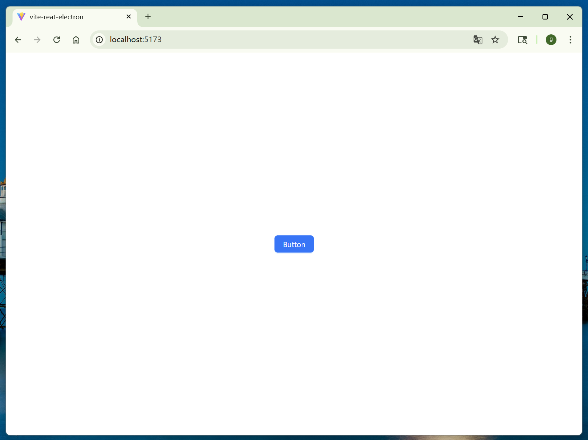
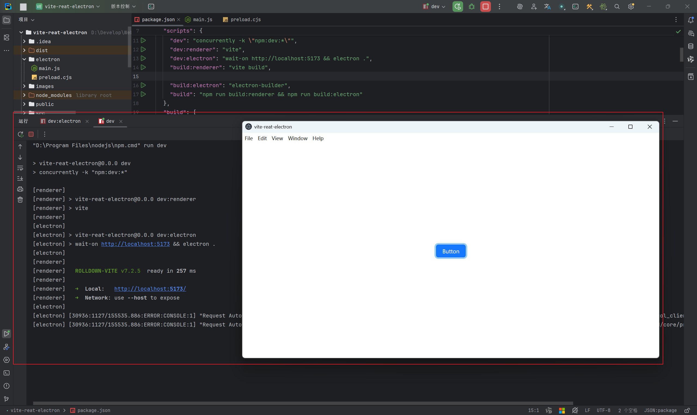
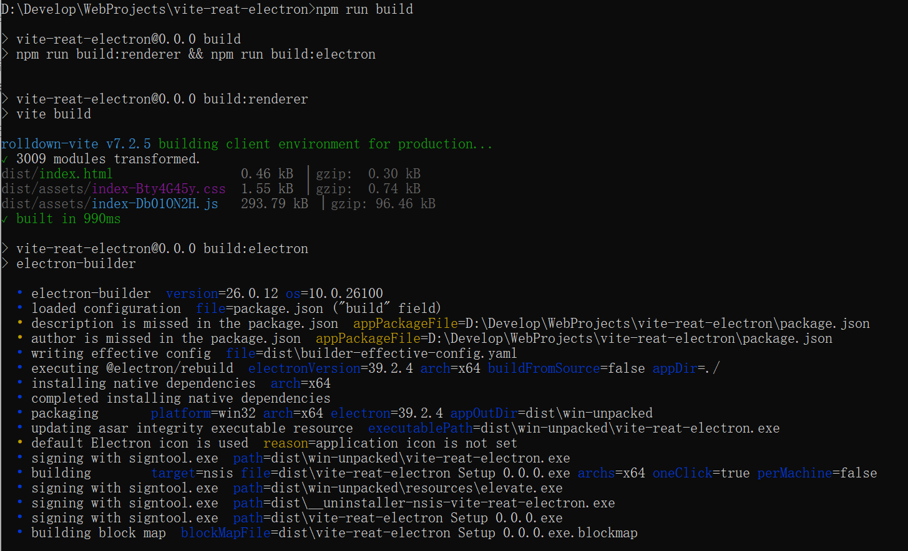
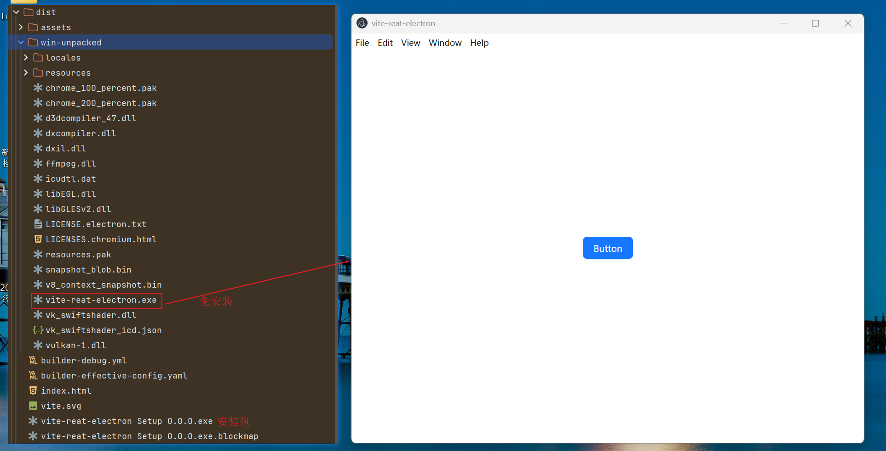

## 一、创建 Vite + React 项目并集成 Ant Design

### 1.项目结构推荐

本文实际采用的是 **更简单的单工程结构**，对于入门和小项目足够了：

    vite-reat-electron
    ├─ dist/           # vite build 之后生成
    ├─ src/            # React 源码
    ├─ electron/
    │  ├─ main.js      # Electron 主进程
    │  └─ preload.cjs   # 预加载脚本（可选）
    ├─ index.html      # Vite 模板
    ├─ vite.config.js
    └─ package.json

> React 前端部分强烈推荐使用 Vite：启动快、配置简单，非常适合作为 Electron 的渲染进程。

### 2.进入项目并安装依赖

```bash
cd D:\Develop\WebProjects

# 用 Vite 创建 React 项目
npm create vite@latest vite-reat-electron -- --template react
```

交互过程大致如下（实际输出略有不同无所谓）：

```bash
Need to install the following packages:
create-vite@8.2.0
Ok to proceed? (y) y


> npx
> create-vite vite-reat-electron --template react

o  Use rolldown-vite (Experimental)?:
   Yes

o  Install with npm and start now?
   Yes

o  Scaffolding project in D:\Develop\WebProjects\vite-reat-electron...
o  Installing dependencies with npm...

added 160 packages in 27s

36 packages are looking for funding
  run `npm fund` for details

> vite-reat-electron@0.0.0 dev
> vite


  ROLLDOWN-VITE v7.2.5  ready in 263 ms

  ➜  Local:   http://localhost:5173/
  ➜  Network: use --host to expose
  ➜  press h + enter to show help
```

### 3.在 React 里引入 Ant Design

#### 3.1 安装依赖

```bash
D:\Develop\WebProjects>cd vite-reat-electron

# 安装 Ant Design 以及图标库
D:\Develop\WebProjects\vite-reat-electron>npm install antd @ant-design/icons
```

#### 3.2 使用`Button`组件

在 `src/App.jsx` 中引入并使用 `Button`：

```jsx
import './App.css'
import {Button} from 'antd';

function App() {
    return (
        <div>
            <Button type="primary">Button</Button>
        </div>
    )
}

export default App
```

#### 3.4 运行项目

```bash
npm run dev
```
浏览器打开 `http://localhost:5173/`，可以看到最基础的 Ant Design 按钮页面：




## 二、添加 Electron 目录结构

在项目根目录新建一个 `electron` 目录，存放主进程和预加载脚本。

**推荐做法：**

- 主进程 `main.js`：使用 ESM（`import`），与 Vite 的 `"type": "module"` 保持一致
- 预加载脚本 `preload.cjs`：使用 CommonJS（`require`），避免在沙箱环境中出现 ESM 相关报错

### 1. `electron/main.js`（主进程，ESM 写法）

```javascript
const { app, BrowserWindow } = require('electron');
const path = require('path');
const url = require('url');

const isDev = !app.isPackaged;

function createWindow() {
  const mainWindow = new BrowserWindow({
    width: 1200,
    height: 800,
    webPreferences: {
      preload: path.join(__dirname, 'preload.cjs'),
      contextIsolation: true,
      nodeIntegration: false,
    },
  });

  if (isDev) {
    // 开发环境：直接连到 Vite dev server
    mainWindow.loadURL('http://127.0.0.1:5173/');
    mainWindow.webContents.openDevTools();
  } else {
    // 生产环境：直接加载 Vite 打包生成的 index.html
    const indexPath = path.join(__dirname, '../dist/index.html');

    mainWindow.loadURL(
      url.pathToFileURL(indexPath).toString()
    );
  }
}

app.whenReady().then(() => {
  createWindow();

  app.on('activate', () => {
    if (BrowserWindow.getAllWindows().length === 0) createWindow();
  });
});

app.on('window-all-closed', () => {
  if (process.platform !== 'darwin') app.quit();
});
```

### 2. `electron/preload.cjs`（预加载脚本，CommonJS）

> Electron 的 preload 默认按 CommonJS 加载。
> 为了省事，直接用 `.cjs + require`，避免 `Cannot use import statement outside a module` 那类错误。

```javascript
// electron/preload.cjs

const { contextBridge } = require('electron');

contextBridge.exposeInMainWorld('electronAPI', {
    ping: () => console.log('ping from preload'),
});
```

- #### 当前项目的一点“小规则”

    - `package.json` 中有 `"type": "module"`
        - 默认 `.js` 当作 ESM 模块，因此：
            - Vite 配置、`electron/main.js` 推荐统一使用 `import` 写法。
    - Electron 的 `preload` 暂时仍按 CommonJS 加载
        - 推荐写成 `preload.cjs`，内部使用 `require`，最稳妥，不容易踩坑。

## 三、修改 Vite 配置

> 目标：让打包后的 `index.html` 能被 `file://` 直接打开，即资源路径使用相对路径。

**关键点：base: './'**

如果不设置，默认是 `'/'`，打包后的 `index.html` 中资源路径会变成 `/assets/...`，

在 Electron 里通过 `file://` 加载时就会 404，出现白屏。

`vite.config.ts` / `vite.config.js` 示例：

```javascript
import { defineConfig } from 'vite';
import react from '@vitejs/plugin-react';

export default defineConfig({
  base: './',        // ⭐ 重点：让资源路径相对当前文件
  plugins: [react()],
  build: {
    outDir: 'dist',  // 默认就是 dist，这里显式写出来
  },
});
```

配置完成后，执行 `npm run build` 会生成：

- `dist/index.html`
- `dist/assets/*`

这些路径都是相对的，可以直接被 Electron 用 `file://` 方式加载。

## 四、在 package.json 中配置脚本与打包（electron-builder）

安装打包相关依赖：

```bash
npm install -D electron electron-builder concurrently wait-on
```

`package.json` 里增加：

```json
{
  "name": "vite-reat-electron",
  "private": true,
  "version": "0.0.0",
  "type": "module",
  "main": "electron/main.js",
  "scripts": {
    "dev": "concurrently -k \"npm:dev:*\"",
    "dev:renderer": "vite",
    "dev:electron": "wait-on http://localhost:5173 && electron .",
    "build:renderer": "vite build",

    "build:electron": "electron-builder",
    "build": "npm run build:renderer && npm run build:electron"
  },
  "build": {
    "appId": "com.example.myapp",
    "files": [
      "dist/**/*",     // ⭐ 把 Vite build 生成的 dist 打包进去
      "electron/**/*", // 主进程 & preload
      "package.json"
    ],
    "directories": {
      "buildResources": "build"
    },
    "win": {
      "target": "nsis"
    },
    "asar": true
  },
  "devDependencies": {
    "concurrently": "^9.2.1",
    "electron": "^39.2.4",
    "electron-builder": "^26.0.12",
    "wait-on": "^9.0.3"
  }
}
```

## 五、 开发时运行

```bash
npm run dev
```
这条命令实际会并行启动两个脚本：

- `npm run dev:renderer` → 启动 Vite 开发服务器
- `npm run dev:electron` → 等待 `http://localhost:5173` 就绪后，启动 Electron，并加载该地址




## 六、 打包

```bash
npm run build
# => 先 vite build 生成 dist/index.html
# => 再 electron-builder 打包应用
```

打包后的应用启动时：

- Electron 主进程运行 `electron/main.js`
- `app.isPackaged === true`
- 于是 `BrowserWindow.loadURL(file:///.../dist/index.html)`
  👉 这就实现了你要的：**直接使用 Vite 项目的 dist/index.html 作为 Electron 主页**，React + Ant Design 正常工作。



## 七、打包后的启动方式（Windows）

- 打包完成后，`dist` 目录下通常会生成两类东西：
    - `win-unpacked/`
        - 免安装版，直接拷贝这一整个目录到目标机器中
        - 双击其中的 `vite-reat-electron.exe` 即可运行
    - `vite-reat-electron Setup 0.0.0.exe`
        - 安装包（NSIS），运行后按向导安装到系统，再从开始菜单或桌面快捷方式启动



## 小结

整体来看，这套流程和普通 Electron 项目的打包方式是类似的：

1. 先由 Vite 产出前端静态资源（`dist`）
2. 再由 electron-builder 统一打包成桌面应用（包含主进程、预加载脚本及前端资源）

本文主要以 Windows 为例进行演示。
如果你还需要打包到 Linux、macOS 等平台，可以在 `package.json` 的 `build` 字段中进一步配置对应平台的 `target`，或参考 electron-builder / Electron 官方文档，它们对各平台的打包选项和目录结构有更详细的说明。

>  博客中有管理Electron在Linux下打包的完整流程。