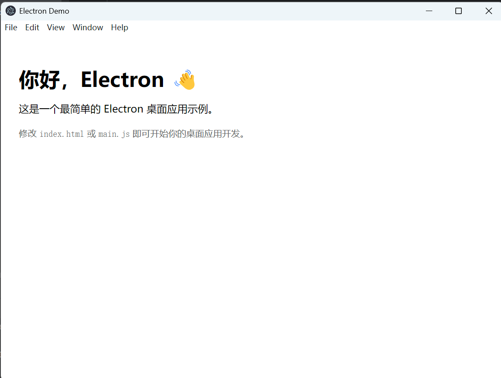

# Electron 应用创建
## 一、环境准备

无论 Windows 还是 Linux，你需要：

- **Node.js**（建议 22+）
- **npm**（随 Node 自带）
- **electron**
- electron-builder

检查版本：

```bash
C:\Windows\System32>node -v
v22.21.1

C:\Windows\System32>npm -v
10.9.4
```

如果你要打包 **Linux ARM**（树莓派等），建议在目标 ARM 机器上进行构建（成功率最高）。

## 二、新建 Electron 项目（从零开始）

### 1.确定项目目录

比如，我们把 Electron 项目放在：

```bash
D:\Develop\WebProjects
```

### 2.初始化项目（生成 package.json）：
在命令行执行：
```bash
cd D:\Develop\WebProjects
mkdir electron
cd electron

npm init -y
```
执行完后，当前目录下会多出一个 package.json 文件，用来描述项目的依赖、脚本、元信息等。

### 3.安装核心依赖

建议使用如下版本，已经经过（**window/Linux**）打包测试

```bash
# Electron 运行时
npm install electron@28.2.0 --save-dev

# 打包工具：electron-builder
npm install electron-builder@24.13.3 --save-dev
```
此时 package.json 里会多出这两个依赖。

## 三、编写最小可运行的 Electron 应用
Electron 至少需要两个东西：

1. 一个 **主进程脚本**（例如 `main.js`）
2. 一个 **渲染进程页面**（例如 `index.html`）

在 electron-app 下这样安排：
```
electron-app
├─ package.json
├─ main.js              # Electron 主进程
├─ preload.js           # 可选：渲染进程桥接用
├─ index.html        # 渲染进程的简单页面
```

### 1.创建主进程入口文件 main.js

在 `electron-app` 目录下，新建 `main.js`，内容如下：

```javascript
// main.js
const { app, BrowserWindow } = require('electron');
const path = require('path');

// 创建主窗口
function createWindow() {
    const win = new BrowserWindow({
        width: 800,
        height: 600,
        webPreferences: {
            // 可以按需要配置，如禁用 nodeIntegration 提升安全性
            nodeIntegration: true,
            contextIsolation: false
        }
    });

    // 加载本地 HTML 文件
    win.loadFile(path.join(__dirname, 'index.html'));

    // 打开开发者工具（开发阶段可打开，打包前可以注释）
    // win.webContents.openDevTools();
}

// Electron 初始化完成后创建窗口
app.whenReady().then(() => {
    createWindow();

    app.on('activate', () => {
        // macOS 上常见行为：没有窗口时点击 Dock 图标重新创建
        if (BrowserWindow.getAllWindows().length === 0) {
            createWindow();
        }
    });
});

// 所有窗口关闭时退出应用（macOS 上习惯不同，这里是 Windows 为主）
app.on('window-all-closed', () => {
    if (process.platform !== 'darwin') {
        app.quit();
    }
});
```

### 2. 创建渲染页面 index.html

在同一目录下，新建 `index.html`：

```html
<!DOCTYPE html>
<html lang="zh-CN">
<head>
    <meta charset="UTF-8" />
    <title>Electron Demo</title>
    <style>
        body {
            font-family: system-ui, -apple-system, BlinkMacSystemFont, "Segoe UI", sans-serif;
            padding: 20px;
        }
        h1 {
            margin-bottom: 10px;
        }
        .tip {
            color: #666;
            margin-top: 20px;
            font-size: 14px;
        }
    </style>
</head>
<body>
<h1>你好，Electron 👋</h1>
<p>这是一个最简单的 Electron 桌面应用示例。</p>

<div class="tip">
    修改 <code>index.html</code> 或 <code>main.js</code> 即可开始你的桌面应用开发。
</div>
</body>
</html>
```

### 3. 修改 package.json，加入启动脚本

打开 `package.json`，做两处修改：

1. 指定入口文件 `"main": "main.js"`
2. 增加一个 `start` 脚本，方便开发时启动

示例（只展示关键部分）：

```json
{
  "name": "electron",
  "version": "1.0.0",
  "description": "My first Electron app",
  "main": "main.js",
  "scripts": {
    "start": "electron ."
  },
  "devDependencies": {
    "electron": "28.2.0",
    "electron-builder": "24.13.3"
  }
}
```

> 版本号以实际安装为准，不需要刻意对齐上面的数字。

### 4. 运行开发环境

在项目根目录执行：

```bash
npm start
```

如果一切正常，会弹出一个 800×600 的窗口，显示你刚才写的 `index.html` 内容，这说明你的 Electron 项目已经 **跑起来了**。🎉🎉🎉
