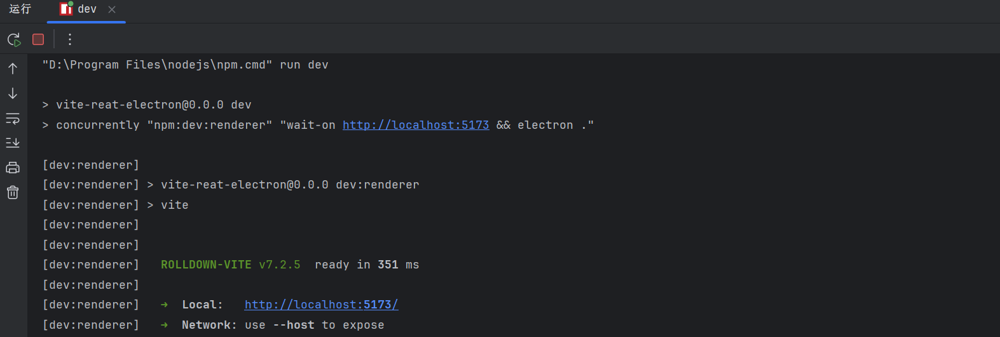
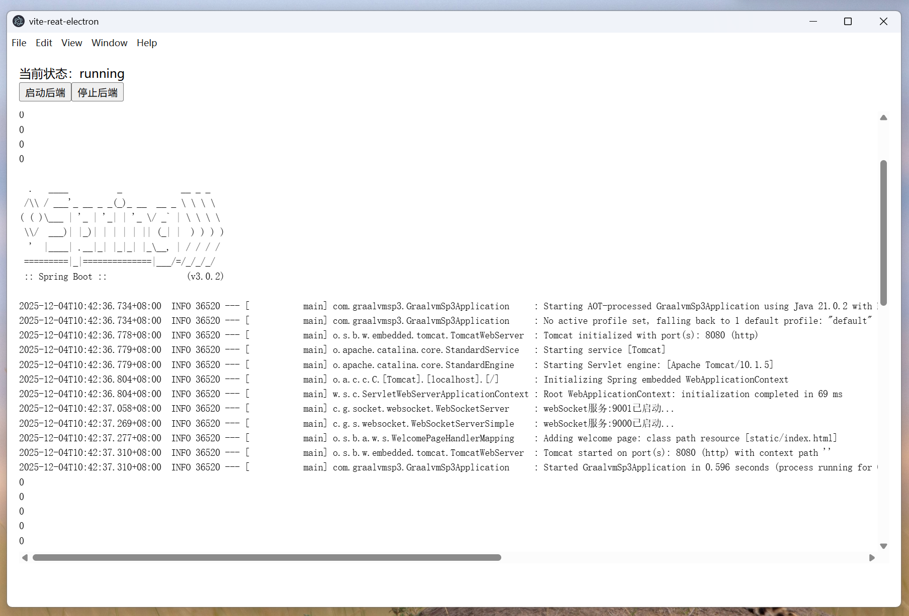
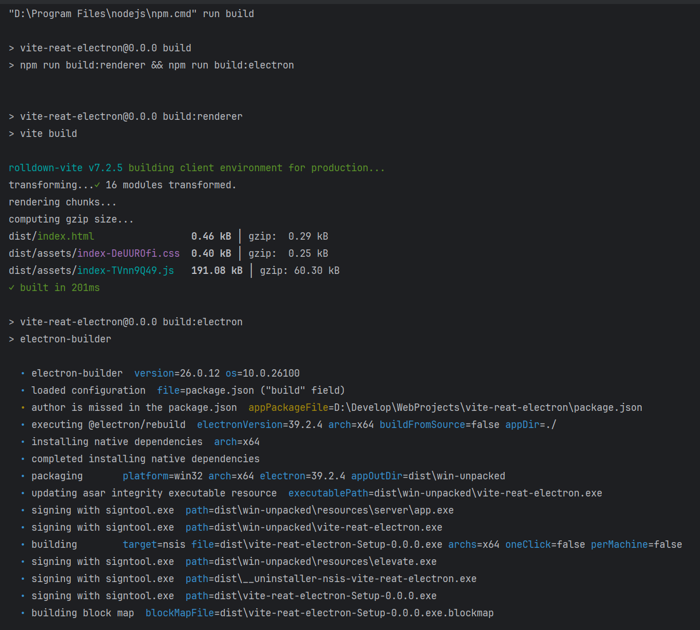
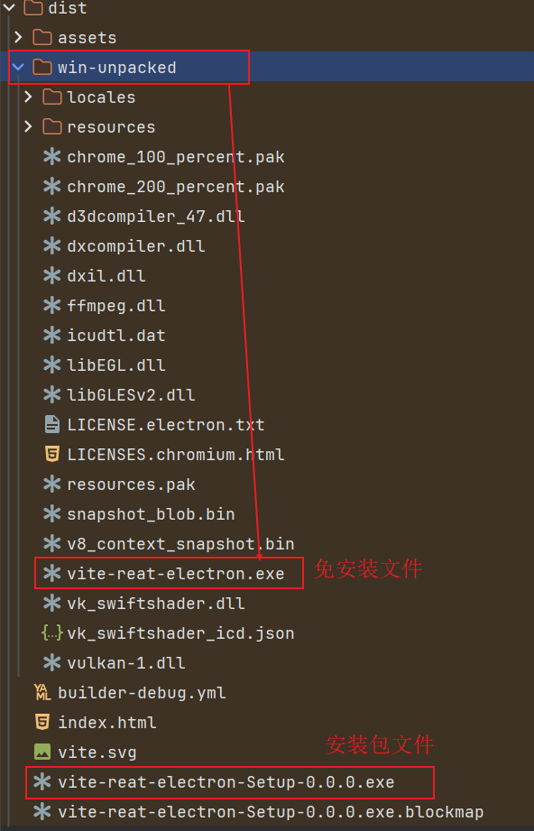
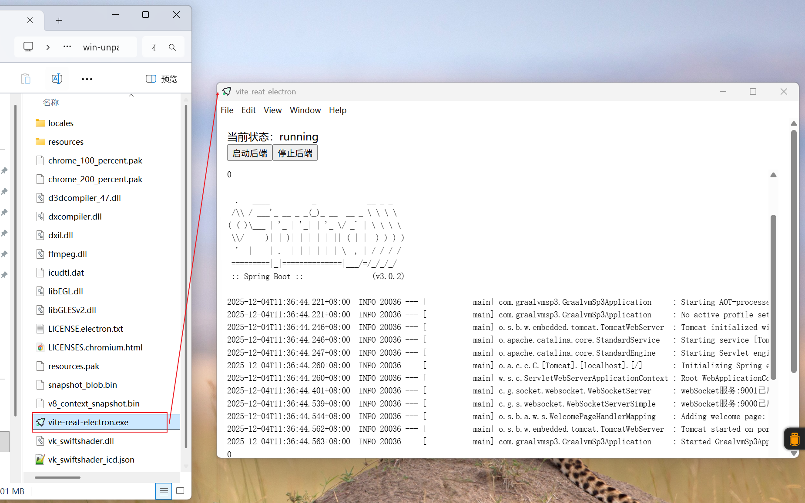
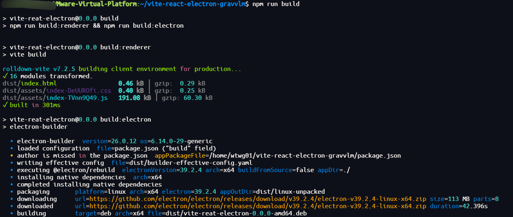
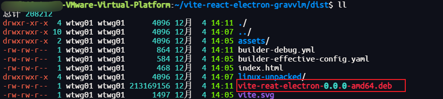
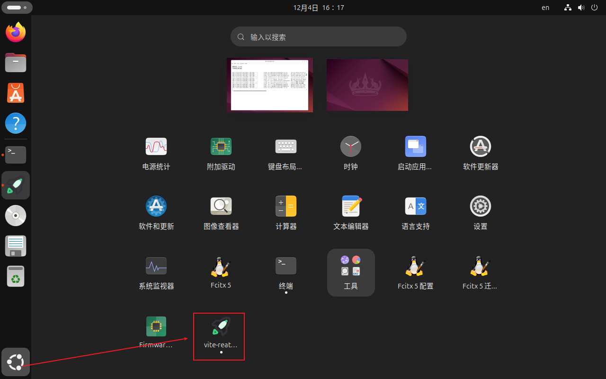
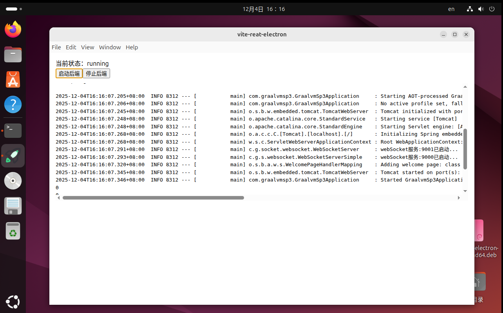
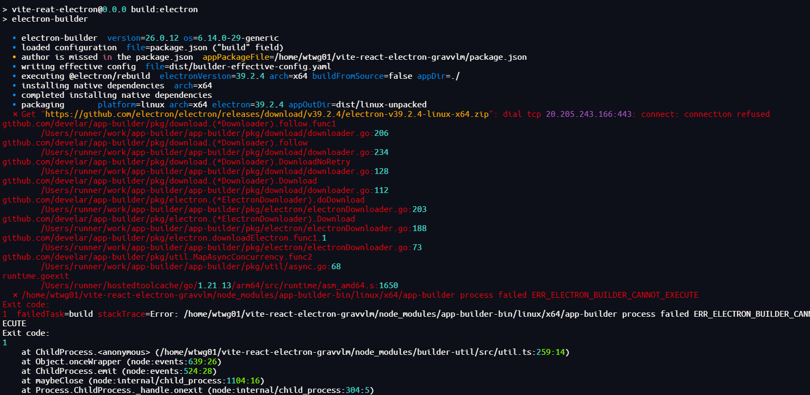

# Electron + (Graalvm + SpringBoot) + Vite 打包不同的平台

前提说明：

- 后端：Spring Boot 已用 GraalVM(native-image) 打成可执行文件（例如：`app.exe` / `app`），可在无 Java 环境中独立运行
- 前端：Vite + React 项目已能正常 `npm run build`, 将Electron集成到项目中

> 相关内容在博客内都有文章

下面直接从「如何打包」开始。

## 1.将后端可执行文件拷贝到 `server` 目录

### 1.1在项目根目录下新建一个 `server` 目录（若已存在可跳过）

```bash
mkdir server
```

最新的目录结构

```text
vite-react-electron
├─ dist/              # Vite 打包后的前端静态文件
├─ src/               # React 源码
├─ server/            # GraalVM native-image 产物 (app.exe / app)
├─ electron/
│  ├─ main.js         # Electron 主进程
│  ├─ javaServer.js   # 后端进程管理 + 日志推送
│  └─ preload.cjs     # 向前端暴露安全的 IPC 接口
├─ index.html
├─ vite.config.js
└─ package.json
```

> ⚠️ 打包时记得把 `server/` 目录作为 `extraResources` 打进安装包（以 electron-builder 为例），否则 `process.resourcesPath/server` 下找不到后端可执行文件。

### 1.2将 GraalVM 打包出的 Spring Boot 可执行文件拷贝到`server`文件夹下，例如：

- Windows：`app.exe`
- Linux / macOS：`app`

说明：

- 这个文件在最终打包时会跟着 Electron 一起被打进安装包。
- 后面我们会在 `main.js` 里通过 `child_process` 启动这个后端服务。

## 2. 配置electron运行文件

`electron/javaServer.js`

职责：

- 根据平台找到对应的可执行文件（`app.exe` / `app`）。
- 启动 / 关闭 GraalVM 打包后的 Spring Boot 应用。
- 把后端日志、状态通过 IPC 推给渲染进程。

```javascript
// electron/javaServer.js
import { app, ipcMain } from 'electron';
import { spawn } from 'child_process';
import path from 'path';
import { fileURLToPath } from 'url';

const __filename = fileURLToPath(import.meta.url);
const __dirname = path.dirname(__filename);

let serverProcess = null;
let serverStatus = 'stopped'; // 'stopped' | 'starting' | 'running' | 'error'

/**
 * 获取后端可执行文件路径
 * 开发环境：项目根目录 /server/app(.exe)
 * 生产环境：resourcesPath/server/app(.exe)
 */
function getServerBinaryPath() {
  const binaryName = process.platform === 'win32' ? 'app.exe' : 'app';

  if (!app.isPackaged) {
    // 开发模式：从源码目录读
    return path.join(__dirname, '..', 'server', binaryName);
  }

  // 生产模式：从打包后的资源目录读
  return path.join(process.resourcesPath, 'server', binaryName);
}

/**
 * 启动后端服务
 * @param {import('electron').BrowserWindow} win
 */
export function startJavaServer(win) {
  if (serverProcess) {
    // 已经有进程了，直接返回当前状态
    return serverStatus;
  }

  const serverPath = getServerBinaryPath();
  serverStatus = 'starting';
  win.webContents.send('java-server/status', serverStatus);

  serverProcess = spawn(serverPath, [], {
    cwd: path.dirname(serverPath),
    stdio: ['ignore', 'pipe', 'pipe']
  });

  // 标准输出日志
  serverProcess.stdout.on('data', (data) => {
    const text = data.toString();
    win.webContents.send('java-server/log', text);

    // 根据你 Spring Boot 的日志内容做简单识别
    if (text.includes('Started') || text.includes('Tomcat started')) {
      serverStatus = 'running';
      win.webContents.send('java-server/status', serverStatus);
    }
  });

  // 错误输出
  serverProcess.stderr.on('data', (data) => {
    const text = data.toString();
    win.webContents.send('java-server/log', text);
  });

  // 正常退出
  serverProcess.on('exit', () => {
    serverStatus = 'stopped';
    win.webContents.send('java-server/status', serverStatus);
    serverProcess = null;
  });

  // 启动失败
  serverProcess.on('error', (err) => {
    serverStatus = 'error';
    win.webContents.send('java-server/log', `Server error: ${err.message}\n`);
    win.webContents.send('java-server/status', serverStatus);
    serverProcess = null;
  });

  return serverStatus;
}

/**
 * 停止后端服务
 */
export function stopJavaServer() {
  if (serverProcess) {
    serverProcess.kill();
    serverProcess = null;
  }
  serverStatus = 'stopped';
}

/**
 * 注册 IPC：渲染进程可以主动调用 start/stop/status
 */
export function registerJavaServerIpc(win) {
  ipcMain.handle('java-server/start', () => {
    return startJavaServer(win);
  });

  ipcMain.handle('java-server/stop', () => {
    stopJavaServer();
    return serverStatus;
  });

  ipcMain.handle('java-server/status', () => {
    return serverStatus;
  });
}
```

`electron/main.js`

职责：

1. 创建窗口。
2. 在窗口创建时启动后端（可选：先启动后端，再 load 页面）。
3. 加载 Vite 构建后的静态资源（生产）或 dev server（开发）。
4. 正确挂载 `preload.cjs`。

```javascript
// electron/main.js
import { app, BrowserWindow } from 'electron';
import path from 'path';
import { fileURLToPath } from 'url';
import {
  registerJavaServerIpc,
  startJavaServer,
  stopJavaServer
} from './javaServer.js';

const __filename = fileURLToPath(import.meta.url);
const __dirname = path.dirname(__filename);

const isDev = !app.isPackaged;

function createWindow() {
  const win = new BrowserWindow({
    width: 1200,
    height: 800,
    webPreferences: {
      preload: path.join(__dirname, 'preload.cjs'),
      contextIsolation: true,
      nodeIntegration: false
    }
  });

  // 注册后端相关 IPC
  registerJavaServerIpc(win);

  // 启动 GraalVM 打包出来的 Spring Boot
  startJavaServer(win);

  // 加载前端页面
  if (isDev) {
    // 开发模式：连 Vite dev server
    win.loadURL('http://localhost:5173').catch((err) => {
      console.error('Failed to load Vite dev server:', err);
    });
  } else {
    // 生产模式：加载打包后的静态文件
    win.loadFile(path.join(__dirname, '..', 'dist', 'index.html')).catch((err) => {
      console.error('Failed to load index.html:', err);
    });
  }

  if (isDev) {
    win.webContents.openDevTools();
  }
}

app.whenReady().then(() => {
  createWindow();

  app.on('activate', () => {
    // macOS：没有窗口时重新创建
    if (BrowserWindow.getAllWindows().length === 0) {
      createWindow();
    }
  });
});

app.on('window-all-closed', () => {
  // 退出前停掉后端
  stopJavaServer();

  if (process.platform !== 'darwin') {
    app.quit();
  }
});
```

`electron/preload.cjs`

职责：

- 在安全的 `contextIsolation` 模式下，把有限的 IPC 能力暴露给前端（window.api）。
- 前端只看到封装好的 `window.javaServer` API，不直接操作 `ipcRenderer`。

```javascript
// electron/preload.cjs
const { contextBridge, ipcRenderer } = require('electron');

const javaServerApi = {
  // 启动后端
  start: () => ipcRenderer.invoke('java-server/start'),
  // 停止后端
  stop: () => ipcRenderer.invoke('java-server/stop'),
  // 查询当前状态
  status: () => ipcRenderer.invoke('java-server/status'),

  // 订阅日志
  onLog: (callback) => {
    const listener = (_event, line) => {
      callback(line);
    };
    ipcRenderer.on('java-server/log', listener);
    // 返回取消订阅函数
    return () => {
      ipcRenderer.removeListener('java-server/log', listener);
    };
  },

  // 订阅状态变化
  onStatusChange: (callback) => {
    const listener = (_event, status) => {
      callback(status);
    };
    ipcRenderer.on('java-server/status', listener);
    return () => {
      ipcRenderer.removeListener('java-server/status', listener);
    };
  }
};

contextBridge.exposeInMainWorld('javaServer', javaServerApi);
```

## 3. 前端页面

编写前端页面

```jsx
import { useEffect, useState } from 'react';

export function ServerPanel() {
    const [status, setStatus] = useState('unknown');
    const [logs, setLogs] = useState([]);

    useEffect(() => {
        window.javaServer.status().then(setStatus);

        const offStatus = window.javaServer.onStatusChange(setStatus);
        const offLog = window.javaServer.onLog((line) => {
            setLogs((prev) => [...prev, line]);
        });

        return () => {
            offStatus();
            offLog();
        };
    }, []);

    return (
        <div>
            <div>当前状态：{status}</div>
            <button onClick={() => window.javaServer.start()}>启动后端</button>
            <button onClick={() => window.javaServer.stop()}>停止后端</button>

            <pre style={{ maxHeight: 300, overflow: 'auto' }}>
        {logs.join('')}
      </pre>
        </div>
    );
}

export default ServerPanel
```

在`App.jsx`页面中引入组件

```jsx
import ServerPanel from './view/Test.jsx'

function App() {
    return (
        <div style={{height: '100vh', padding: 16, boxSizing: 'border-box'}}>
            <ServerPanel/>
        </div>
    )
}

export default App
```

## 4. 配置`package.json`

> 优化一下 dev 脚本

```json
"scripts": {
    "lint": "eslint .",
    "preview": "vite preview",
    "dev:renderer": "vite",
    "dev": "concurrently \"npm:dev:renderer\" \"wait-on http://localhost:5173 && electron .\"",
    "electron:only": "electron .",
    "build:renderer": "vite build",
    "build:electron": "electron-builder",
    "build": "npm run build:renderer && npm run build:electron"
  }
```

- 开发时：`npm run dev`
  自动起 Vite + Electron（主进程会走 `isDev` 分支，连到 `http://localhost:5173`）。
- 打包时：`npm run build`
  先 `vite build` 输出到 `dist/`，再 `electron-builder`，你 `build.extraResources` 里已经把 `server` 目录打进去了，和我们 `javaServer.js` 的 `process.resourcesPath/server` 是对得上的。

## 5. 开发环境测试运行

```bash
npm run dev
```


启动结果



> 出现以上内容证明，整个运行流程都是没问题的

## 6.测试打包

### 6.1 修改`package.json`

增加`build`属性

```json
"build": {
  "appId": "com.example.myapp",
  "files": [
    "dist/**/*",
    "electron/**/*",
    "package.json"
  ],
  "extraResources": [
    {
      "from": "server",
      "to": "server"
    }
  ],
  "directories": {
    "buildResources": "build"
  },
  "win": {
    "target": "nsis",
    "artifactName": "${productName}-Setup-${version}.${ext}"
  },
  "nsis": {
    "oneClick": false,
    "perMachine": false,
    "allowToChangeInstallationDirectory": true
  },
  "linux": {
    "target": ["deb"],
    "category": "Utility",
    "maintainer": "xxxxxx@qq.com",
    "artifactName": "${productName}-${version}-${arch}.${ext}"
  },
  "asar": true
}
```

文件内容解释

##### appId`

```
"appId": "com.example.myapp"
```

- 应用的唯一 ID（类似 Android 的包名）。
- 在 Windows / macOS / Linux 上用来区分不同应用。
- 一般建议用你自己的域名反写，比如：`com.xxx.graalvmDemo`。

------

##### `files`

```
"files": [
  "dist/**/*",
  "electron/**/*",
  "package.json"
]
```

- 告诉 electron-builder：**哪些文件要打包进应用主目录**（`app.asar` 或应用文件夹）：
    - `dist/**/*`：你的 Vite 打包出来的前端页面（`index.html`、js/css 静态资源）。
    - `electron/**/*`：主进程代码、preload、javaServer 管理脚本等。
    - `package.json`：应用的元信息（给 Electron 运行时用，不是 npm 用的了）。

> 简单理解：这些是“应用本体”的代码和资源。

------

##### `extraResources`

```
"extraResources": [
  {
    "from": "server",
    "to": "server"
  }
]
```

- 把项目根目录下的 `server` 文件夹 **原样拷贝** 到最终应用的“资源目录”里。
- 打包后，它会出现在 `process.resourcesPath/server` 下。
- 这就是你 GraalVM 打出来的 `app.exe` / `app` 能被 `javaServer.js` 找到的关键。

对应我们之前的逻辑：

```
// javaServer.js 里
return path.join(process.resourcesPath, 'server', binaryName);
```

开发环境直接用源码目录，生产环境用 `extraResources` 拷进去的这个 `server`。

------

##### `directories.buildResources`

```
"directories": {
  "buildResources": "build"
}
```

- 指定一个目录，用来放**图标、安装器配置等打包时用到的资源**。
- 比如 Windows 的图标 `.ico`、Linux 的 `.png` 图标。
- electron-builder 会在这里面找默认的资源文件。

如果你后面要设置图标，可以放在 `build/icon.png` / `build/icon.ico` 之类，然后在配置里写。

------

#### Windows 相关

##### `win`

```
"win": {
  "target": "nsis",
  "artifactName": "${productName}-Setup-${version}.${ext}"
}
```

- 说明：构建 Windows 安装包的配置。

字段说明：

- `"target": "nsis"`
    - 使用 NSIS 生成 **安装向导**（.exe 安装程序），而不是绿色版解压。
- `"artifactName": "${productName}-Setup-${version}.${ext}"`
    - 安装包文件名的模板：
        - `${productName}`：来自 `package.json` 的 `productName`（没有则用 `name`）。
        - `${version}`：package.json 里的版本号。
        - `${ext}`：根据 target 自动填 `.exe`。

举个例子：
`productName: "GraalVM Demo"，version: "1.0.0"`
最终可能是：`GraalVM Demo-Setup-1.0.0.exe`

------

##### `nsis`

```
"nsis": {
  "oneClick": false,
  "perMachine": false,
  "allowToChangeInstallationDirectory": true
}
```

- 这是 NSIS 安装器的细化配置（只在 Windows + target=nsis 时生效）。

字段解释：

- `oneClick: false`
    - **关闭“一键安装”**，改为标准安装向导：下一步 → 选择目录 → 完成。
- `perMachine: false`
    - 默认安装给**当前用户**（不是所有用户），不需要管理员权限（一般装在 `C:\Users\xxx\AppData\Local`）。
- `allowToChangeInstallationDirectory: true`
    - 允许用户在安装时自己选安装路径。

------

#### Linux 相关

##### `linux`

```
"linux": {
  "target": ["deb"],
  "category": "Utility",
  "maintainer": "xxxxxx@qq.com",
  "artifactName": "${productName}-${version}-${arch}.${ext}"
}
```

- Linux 平台打包行为配置。

字段解释：

- `"target": ["deb"]`
    - 打成 **Debian 系**的 `.deb` 安装包（Ubuntu / Debian 等）。
- `"category": "Utility"`
    - 在 Linux 应用菜单里的分类（工具类应用）。
- `"maintainer": "xxxxxx@qq.com"`
    - 包的维护者信息，一般写名字 + 邮箱：`"YourName <you@example.com>"` 更规范。
- `"artifactName": "${productName}-${version}-${arch}.${ext}"`
    - 和 Windows 类似，控制输出文件名：
        - `${arch}`：架构，比如 `x64`、`arm64`。
        - `${ext}`：比如 `.deb`。

例：`GraalVM Demo-1.0.0-x64.deb`

------

##### `asar`

```
"asar": true
```

- 是否把应用代码打包成一个 `app.asar` 文件。
- 优点：
    - 文件集中，一个大包，看起来干净。
    - 一定程度上“模糊”源码，不是明文散落在目录。
- 缺点：
    - 如果你要动态修改文件（写源码同目录），可能需要关 asar 或者搞 `extraResources`。
- 你这套配置里，后端可执行文件放在 `extraResources/server`，**不在 asar 里面**，所以没问题。

### 6.2 增加打包运行图标

#### 6.2.1 准备图标文件

常规做法：

- Windows：一张 `.ico` 最小为 256x256
- Linux：一张 `.png`
  -（如果以后加 macOS）：一张 `.icns`

建议尺寸：

- `.ico`：512×512（内部可以包含多尺寸）
- `.png`：512×512

放到项目里，比如：

```
vite-react-electron
├─ build/
│  ├─ icon.ico   # Windows 用
│  └─ icon.png   # Linux 用
```

> ⚠️ `build/` 就是你 `buildResources` 指向的目录。

#### 6.2.2 在 `build` 里配置 icon

在 `package.json` 里的 `"build"` 改成类似这样（只贴关键部分）：

```json
"build": {
  "appId": "com.example.myapp",
  "files": [
    "dist/**/*",
    "electron/**/*",
    "package.json"
  ],
  "extraResources": [
    { "from": "server", "to": "server" }
  ],
  "directories": {
    "buildResources": "build"
  },

  // ⭐ Windows 图标
  "win": {
    "target": "nsis",
    "artifactName": "${productName}-Setup-${version}.${ext}",
    "icon": "build/icon.ico"        // <- 加这一行
  },

  "nsis": {
    "oneClick": false,
    "perMachine": false,
    "allowToChangeInstallationDirectory": true
  },

  // ⭐ Linux 图标
  "linux": {
    "target": ["deb"],
    "category": "Utility",
    "maintainer": "xxxxxx@qq.com",
    "artifactName": "${productName}-${version}-${arch}.${ext}",
    "icon": "build/icon.png"        // <- 加这一行
  },

  "asar": true
}
```

解释一下：

- `"icon": "build/icon.ico"`
  路径是**相对于项目根目录**的，不是相对于 `buildResources`，但你刚好也是 `build/`，所以这么写最直观。
- `"linux.icon": "build/icon.png"`
  Linux 下会用这个 png 作为桌面图标、应用菜单图标等。

------

#### 6.2.3 打包后效果

- Windows：
    - 安装包右键图标会是 `.ico`。
    - 安装后的桌面图标 / 开始菜单图标也会用这个图标。
- Linux：
    - `.deb` 安装后，在应用菜单里看到的图标就是你这张 png。

### 6.3 Windows 环境下打包

Windows 下无需额外配置，直接在项目根目录执行：

```bash
npm run build
```
执行完成后，`electron-builder` 会自动：

- 构建 Vite 前端
- 构建 Electron 主进程
- 将 GraalVM native-image 打包的后端（放在 server/ 下）一起封装进安装包

打包完成后，目录结构如下：



其中重点目录：

| 目录                    | 说明                                |
| ----------------------- | ----------------------------------- |
| **dist/**               | 打包输出目录（Electron 的最终产物） |
| **dist/win-unpacked/**  | 未安装版（绿色版）文件，可直接运行  |
| **xxx-Setup-x.y.z.exe** | 安装向导版，可双击安装到系统        |



##### 6.3.1 在 Windows 下直接运行绿色版

无需安装，进入：

```text
dist/win-unpacked/
```

双击运行：

```
xxxxxxx.exe
```

即可启动 Electron + GraalVM 后端的完整应用：



> 绿色版特别适合开发环境测试，不会向系统写入启动菜单、注册表等信息。

### 6.4 Linux 环境下打包

Linux 打包必须在 Linux 系统中进行（**不能在 Windows / macOS 交叉编译出 Linux**），原因是：

- Electron 会根据当前平台下载对应的运行时（x64 / arm64）
- 你的 GraalVM native-image 也必须是 Linux 上构建出来的二进制

> 简单说：**什么系统就打什么系统的安装包**
>
> amd64 → 打 amd64
>
> arm64 → 打 arm64
>
> 二者不能混用

本节使用 **Ubuntu 24（x86_64）虚拟机**演示。

##### 6.4.1 上传项目到 Linux 系统

将完整项目目录上传到 Linux 虚拟机（推荐使用 `XTerminal`）。

进入项目根目录：

```bash
cd vite-react-electron-gravvlm
```

##### 6.4.2 安装依赖

```bash
npm install
```

Linux 会根据自身架构重新安装依赖

不需要手动安装 Electron，electron-builder 会自动下载对应的 Linux 版本

##### 6.4.3 一键构建 Linux 安装包

```bash
npm run build
```

包含两个步骤：

| 步骤                 | 内容                                          |
| -------------------- | --------------------------------------------- |
| **vite build**       | 构建前端资源到 `dist/`                        |
| **electron-builder** | 打包为 `.deb` 和 `linux-unpacked`（未安装版） |

输出结果如下：



##### 6.4.4 打包生成的文件说明

```reStructuredText
dist/
 └─ vite-reat-electron-0.0.0-amd64.deb  # Linux 安装包
```



`.deb` 安装包

这是最终可安装的 Linux 软件包，可直接安装：

```bash
sudo dpkg -i MyApp-1.0.0-x64.deb
```

安装完成后，你可以：

- 在 **应用菜单** 中找到应用图标
- 直接启动（Electron 启动后会自动运行 GraalVM native-image 后端）



启动后结果



### 7. 完整`package.json`

```json
{
  "name": "vite-reat-electron",
  "private": true,
  "version": "0.0.0",
  "homepage": "https://example.com/graalvm-electron-demo",
  "license": "MIT",
  "description": "GraalVM + Electron demo",
  "type": "module",
  "main": "electron/main.js",
  "scripts": {
    "lint": "eslint .",
    "preview": "vite preview",
    "dev:renderer": "vite",
    "dev": "concurrently \"npm:dev:renderer\" \"wait-on http://localhost:5173 && electron .\"",
    "electron:only": "electron .",
    "build:renderer": "vite build",
    "build:electron": "electron-builder",
    "build": "npm run build:renderer && npm run build:electron"
  },
  "build": {
    "appId": "com.example.myapp",
    "files": [
      "dist/**/*",
      "electron/**/*",
      "package.json"
    ],
    "extraResources": [
      {
        "from": "server",
        "to": "server"
      }
    ],
    "directories": {
      "buildResources": "build"
    },
    "win": {
      "target": "nsis",
      "artifactName": "${productName}-Setup-${version}.${ext}",
      "icon": "build/icon.ico"
    },
    "nsis": {
      "oneClick": false,
      "perMachine": false,
      "allowToChangeInstallationDirectory": true
    },
    "linux": {
      "target": ["deb"],
      "category": "Utility",
      "maintainer": "xxxxx@qq.com",
      "artifactName": "${productName}-${version}-${arch}.${ext}",
      "icon": "build/icon.png"
    },
    "asar": true
  },
  "dependencies": {
    "@ant-design/icons": "^6.1.0",
    "antd": "^6.0.0",
    "react": "^19.2.0",
    "react-dom": "^19.2.0"
  },
  "devDependencies": {
    "@eslint/js": "^9.39.1",
    "@types/react": "^19.2.5",
    "@types/react-dom": "^19.2.3",
    "@vitejs/plugin-react": "^5.1.1",
    "concurrently": "^9.2.1",
    "electron": "^39.2.4",
    "electron-builder": "^26.0.12",
    "eslint": "^9.39.1",
    "eslint-plugin-react-hooks": "^7.0.1",
    "eslint-plugin-react-refresh": "^0.4.24",
    "globals": "^16.5.0",
    "vite": "npm:rolldown-vite@7.2.5",
    "wait-on": "^9.0.3"
  },
  "overrides": {
    "vite": "npm:rolldown-vite@7.2.5"
  }
}
```

### 8. 打包遇到问题解决

#### 8.1 网络问题，无法下载镜像文件

```bash
root@pc-VMware-Virtual-Platform:~$ export ELECTRON_MIRROR="https://npmmirror.com/mirrors/electron/"
root@pc-VMware-Virtual-Platform:~$ export ELECTRON_CACHE="$HOME/.cache/electron"
root@pc-VMware-Virtual-Platform:~$ export ELECTRON_BUILDER_BINARIES_MIRROR="https://npmmirror.com/mirrors/electron-builder-binaries/"
```




重新执行

```bash
npm run build
```


# 小结

| 平台                  | 是否支持跨平台打包 | 说明                          |
| --------------------- | ------------------ | ----------------------------- |
| Windows → Linux       | ❌ 不支持           | Electron 运行时无法跨平台打包 |
| Linux → Windows       | ❌ 不支持           | 需要 Win 的工具链             |
| macOS → Windows/Linux | ❌ 不支持           | 需要对应平台工具链            |
| Linux → Linux         | ✔️ 支持             | 推荐用于构建 Linux 安装包     |

**最佳实践：在哪个平台运行，就在对应的平台打包。**