# 使用 GraalVM 将普通 Java 项目打包成 Windows/Linux 可执行文件

> 使用 GraalVM 将普通 Java 项目打包成跨平台原生可执行文件（Windows & Linux）

## 1. 环境准备

> 详细的安装教程请阅读**GraalVM 安装**

1. **安装 GraalVM**
   - 例如：`D:\DevelopTools\graalvm-community-openjdk-21.0.2`
   - 确保已安装 `native-image` 组件。
2. **安装 Visual Studio / Build Tools**
   - 需要能够打开：**x64 Native Tools Command Prompt for VS**
   - `native-image` 在 Windows 下会依赖 MSVC 工具链。
3. **项目依赖**
   - 所有三方依赖（如 fastjson、Netty 等），统一放在项目根目录的 `lib` 目录下。
   - 示例中使用的主类为：`com.yj.NettyServer`。

后文将分别给出：

- Windows：`run.cmd`
- Linux：`run.sh`

## 2. Windows 下打包原生可执行文件

### 2.1  项目目录示例

项目目录结构：
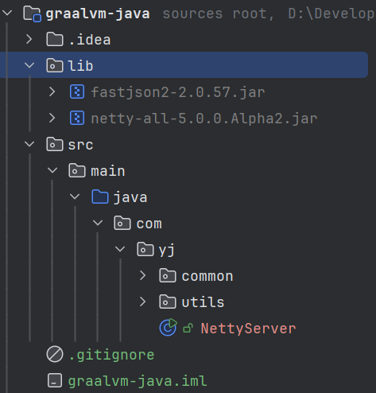

### 2.2 打包脚本 run.cmd

> 将下面内容保存为项目根目录下的 **run.cmd**，然后在**x64 Native Tools Command Prompt for VS** 中执行：

```bash
@echo off
setlocal

rem ================================
rem 1. 配置环境
rem ================================
rem GraalVM 安装目录
set "GRAALVM_HOME=D:\DevelopTools\graalvm-community-openjdk-21.0.2"
set "PATH=%GRAALVM_HOME%\bin;%PATH%"

rem 主类全限定名（根据自己项目修改）
set "MAIN_CLASS=com.yj.NettyServer"

rem 最终生成的 exe 名称（不带后缀）
set "APP_NAME=netty-server-win"

rem 如果想让 CMD 支持 UTF-8 输出，可以打开这一行
rem chcp 65001 >nul

echo.
rem 收集 src\main\java 下所有 .java 文件到 sources.txt ...
echo == 步骤 1：收集源文件 ==
if exist sources.txt del /f /q sources.txt
for /R src\main\java %%f in (*.java) do @echo %%f>>sources.txt

echo.
echo == 步骤 2：编译所有源码 ==
if exist out rmdir /s /q out
mkdir out

javac -cp "lib/*" -d out @sources.txt
if errorlevel 1 (
    echo [ERROR] javac 编译失败，退出。
    goto :end
)

echo.
echo == 步骤 3：生成 MANIFEST.MF ==
>MANIFEST.MF echo Main-Class: %MAIN_CLASS%
>>MANIFEST.MF echo.

echo.
echo == 步骤 4：打包为 app.jar ==
if exist app.jar del /f /q app.jar
jar cfm app.jar MANIFEST.MF -C out .
if errorlevel 1 (
    echo [ERROR] jar 打包失败，退出。
    goto :end
)

echo.
echo == 步骤 5：使用 GraalVM native-image 生成 %APP_NAME%.exe ==
rem 关键参数：-H:-CheckToolchain 避免某些环境下的工具链检查问题
native-image ^
  --no-fallback ^
  -H:-CheckToolchain ^
  -cp "app.jar;lib/*" ^
  %MAIN_CLASS% ^
  %APP_NAME%

if errorlevel 1 (
    echo [WARN] native-image 返回非 0（但有可能 exe 已经生成），请检查上方日志。
    goto :end
)

echo.
echo =============================
echo 构建完成：%APP_NAME%.exe
echo =============================

:end
endlocal
pause
```

**说明：**

- `MAIN_CLASS`：你的应用入口类，需和 `main` 方法所在类的全限定名一致。
- `APP_NAME`：最终生成的 `.exe` 文件名。
- `-cp "app.jar;lib/*"`：将你的业务代码（`app.jar`） + 所有依赖（`lib` 下的 jar）都打进 native 镜像的 classpath。
- `--no-fallback`：不生成 fallback 的 JVM 模式镜像，生成的就是纯原生可执行文件。
- `-H:-CheckToolchain`：在某些 Windows 环境下可避免工具链检测的报错。

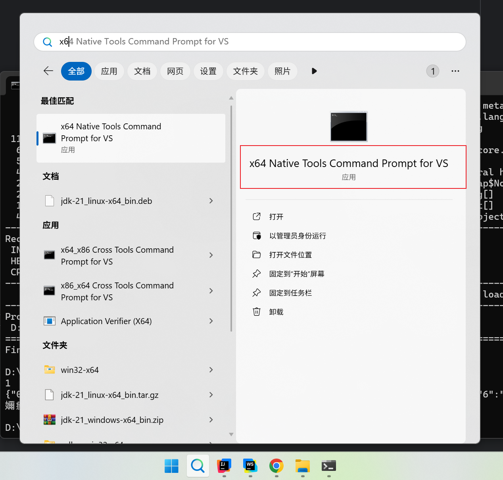

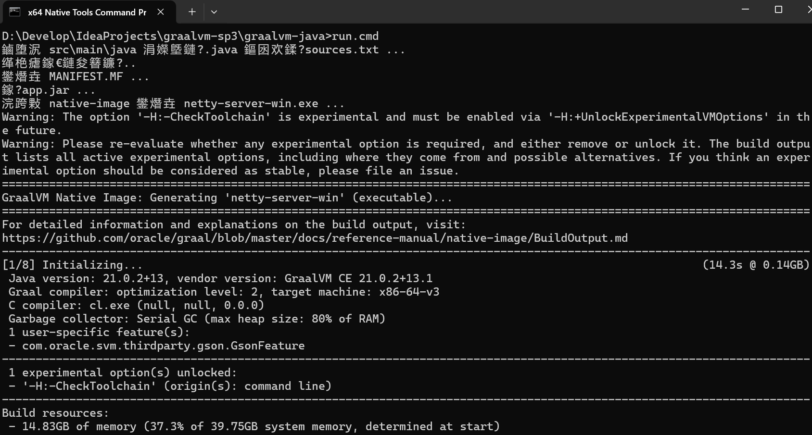
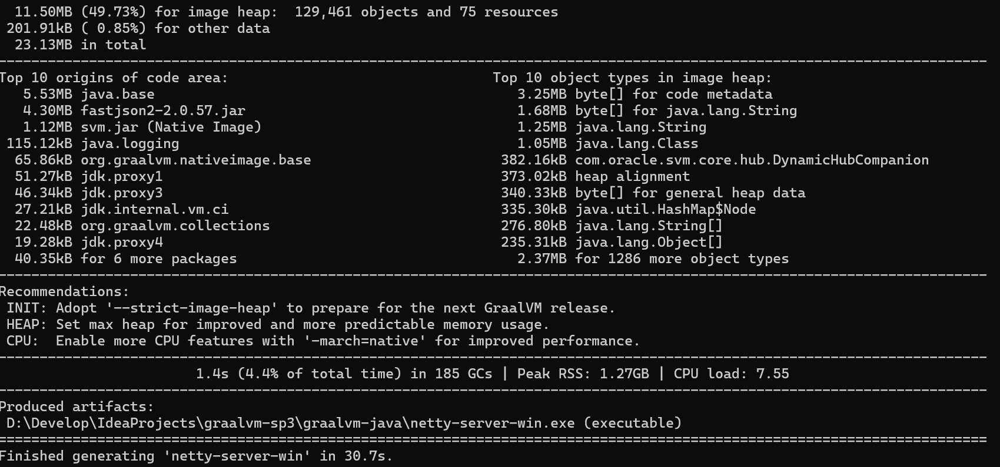

### 2.3 脚本执行后的产物

执行 `run.cmd` 成功后，项目根目录会新增（或更新）：

- `sources.txt` – 所有 `src\main\java` 下的 `.java` 文件列表
- `out/` – 编译输出的 `.class` 文件目录
- `MANIFEST.MF` – JAR 清单文件（包含 `Main-Class`）
- `app.jar` – 打好的可运行 JAR 包
- `netty-server-win.exe` – 使用 `native-image` 生成的 Windows 可执行文件（名称取决于 `APP_NAME`）

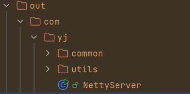
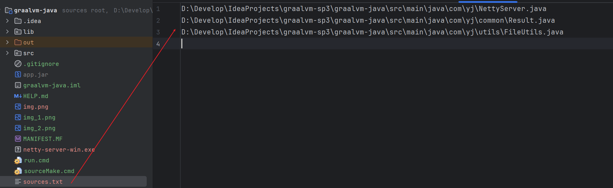
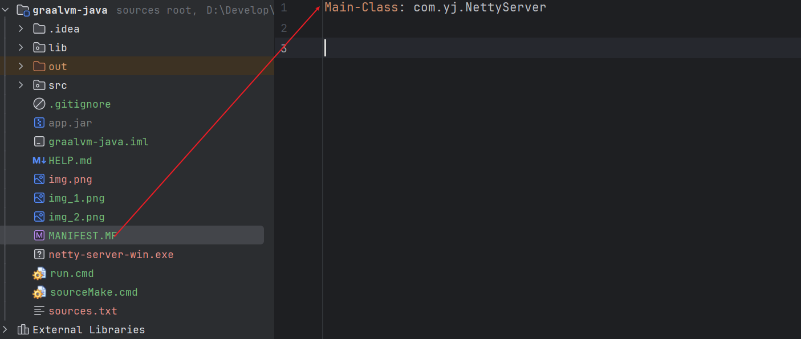

### 2.4 测试运行

> 在main函数中写了一些输出的内容，忽略乱码，这个是因为CMD格式导致，就不调整了。

示例 `main` 方法（简化版）：

```java
public class NettyServer {

    public static void main(String[] args) {
        System.out.println(1);
        Map<String, String> map = new HashMap<>();
        for (int i = 0; i < 10; i++) {
            map.put(i + "", "测试" + i);
        }
        System.out.println(JSON.toJSONString(map));
    }
}
```

在生成目录下执行（双击或命令行）：

```bash
netty-server-win.exe
```

如果控制台编码不是 UTF-8，中文可能会有少量乱码，这是正常现象。可以：

- 在脚本中打开 `chcp 65001` 以切换到 UTF-8
- 或在控制台中手动调整编码 / 字体

### 2.5 运行结果

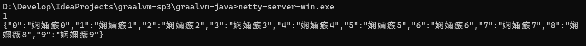

### 2.6.小结

整个过程可以概括为：

1. 使用 `javac` 编译所有源码 → 输出到 `out/`
2. 用 `jar` + `MANIFEST.MF` 打出 `app.jar`
3. 用 `native-image` 把 `app.jar` + 依赖，打成原生 `.exe`

你现在已经有了一套可以复制到任意普通 Java 项目的 **“一键打包脚本”**，只需要调整：

- `GRAALVM_HOME`
- `MAIN_CLASS`
- `APP_NAME`
- 和 `lib` 目录中的依赖

就可以快速生成对应项目的原生可执行文件。

## 4. Linux 版的一键打包脚本

用 WSL 在 Windows（10/11） 上直接构建 Linux Native Image

### 4.1 确认你的 WSL 是 Ubuntu（或其它 Linux）

```bash
wsl -l -v
```

### 4.2 进入 WSL（Linux 环境）

```bash
wsl
```


### 4.3 新建打包脚本 `run.sh`

进入项目根目录

```bash
cd /mnt/d/Develop/IdeaProjects/graalvm-sp3/graalvm-java/
```

在你的项目根目录下，新建一个文件 **run.sh**，内容如下：

```bash
#!/usr/bin/env bash
set -e

########################################
# 1. 基本配置
########################################

# GraalVM 安装目录（按自己实际修改）如果已经有了环境，可以删除下面的内容
GRAALVM_HOME="/opt/graalvm/graalvm-community-openjdk-21.0.2+13.1"
export PATH="$GRAALVM_HOME/bin:$PATH"

# 主类全限定名（根据自己项目修改）
MAIN_CLASS="com.yj.NettyServer"

# 生成的可执行文件名（不要带后缀）
APP_NAME="netty-server-linux"

########################################
# 2. 准备工作
########################################

echo
echo "== 步骤 1：检查 GraalVM / native-image =="

if ! command -v native-image >/dev/null 2>&1; then
  echo "[ERROR] 未找到 native-image，请确认："
  echo "  1) GraalVM 已安装：$GRAALVM_HOME"
  echo "  2) 已执行：gu install native-image"
  exit 1
fi

echo
echo "== 步骤 2：收集源文件到 sources.txt =="

rm -f sources.txt
# 收集 src/main/java 下所有 .java 源文件
find src/main/java -name "*.java" > sources.txt

########################################
# 3. 编译
########################################

echo
echo "== 步骤 3：编译 Java 源码到 out/ 目录 =="

rm -rf out
mkdir -p out

# -cp 'lib/*'：把 lib 目录下所有依赖 jar 加入编译 classpath
javac -cp "lib/*" -d out @sources.txt

########################################
# 4. 打包 JAR
########################################

echo
echo "== 步骤 4：生成 MANIFEST.MF =="

cat > MANIFEST.MF <<EOF
Main-Class: ${MAIN_CLASS}

EOF

echo
echo "== 步骤 5：打包为 app.jar =="

rm -f app.jar
jar cfm app.jar MANIFEST.MF -C out .

########################################
# 5. 使用 native-image 生成原生可执行文件
########################################

echo
echo "== 步骤 6：使用 native-image 生成 ${APP_NAME} =="

# 这里如果你有很多反射 / 动态特性，后续可以再加配置文件
native-image \
  --no-fallback \
  -cp "app.jar:lib/*" \
  "${MAIN_CLASS}" \
  "${APP_NAME}"

echo
echo "==============================="
echo " 构建完成： ./${APP_NAME}"
echo "==============================="

# 可选：赋予执行权限
chmod +x "${APP_NAME}"
```

### 4.4 赋予执行权限并运行

在项目根目录执行：

```bash
chmod +x run.sh
./run.sh
```
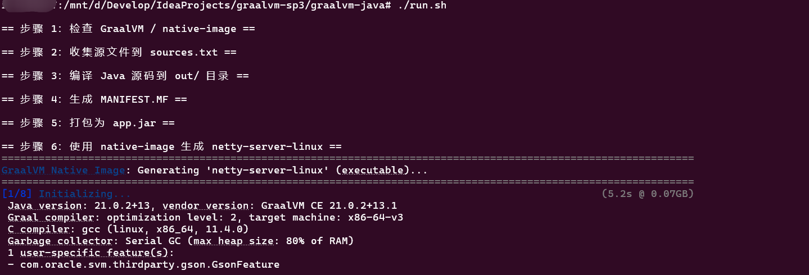
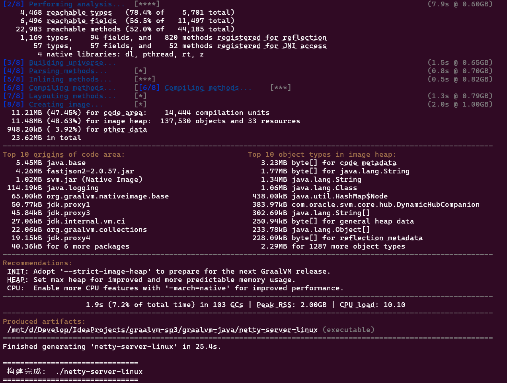
执行成功后，目录中会生成这些文件/目录：

- `sources.txt` – 源文件列表
- `out/` – `.class` 编译输出目录
- `MANIFEST.MF` – Jar 清单
- `app.jar` – 可运行 Jar 包
- `netty-server-linux` – 原生 Linux 可执行文件（名字取决于 `APP_NAME`）

运行程序：

```bash
./netty-server-linux
```

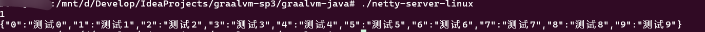

### 4.5 Linux 环境小提示

**构建依赖**

- 一般需要基本构建工具链，例如 Ubuntu 可以：

  ```
  sudo apt-get update
  sudo apt-get install build-essential zlib1g-dev
  ```

