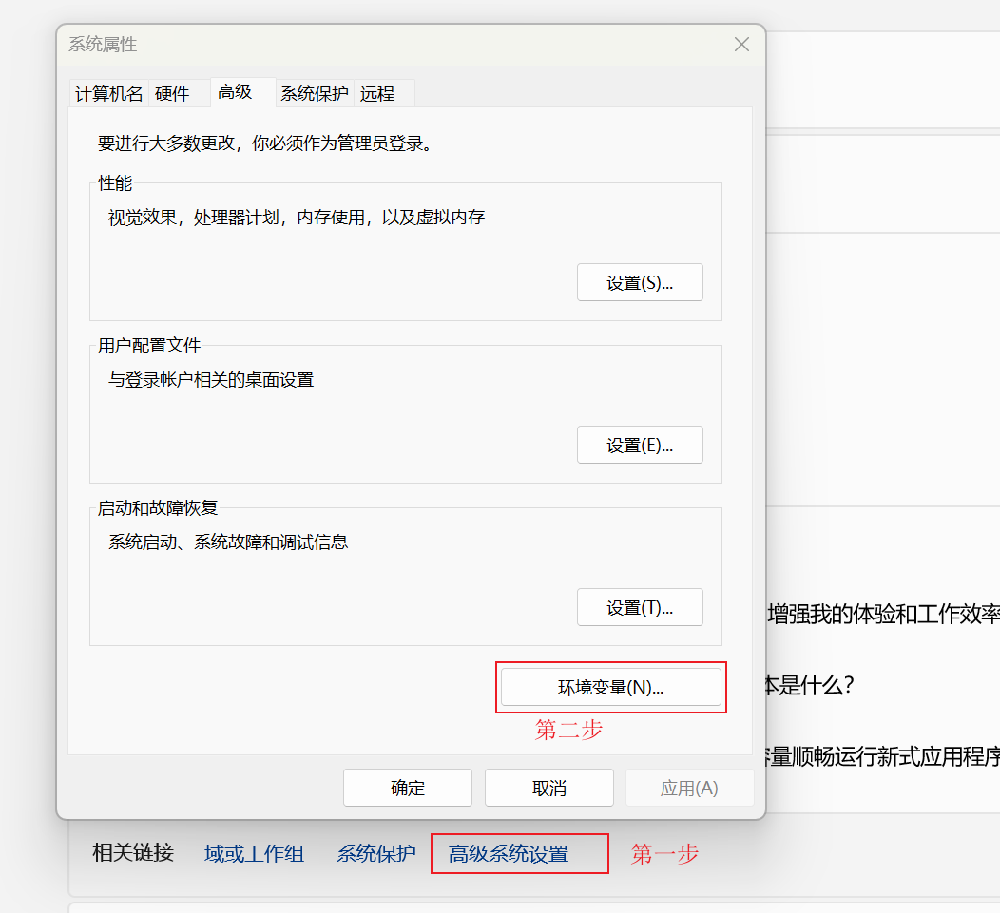
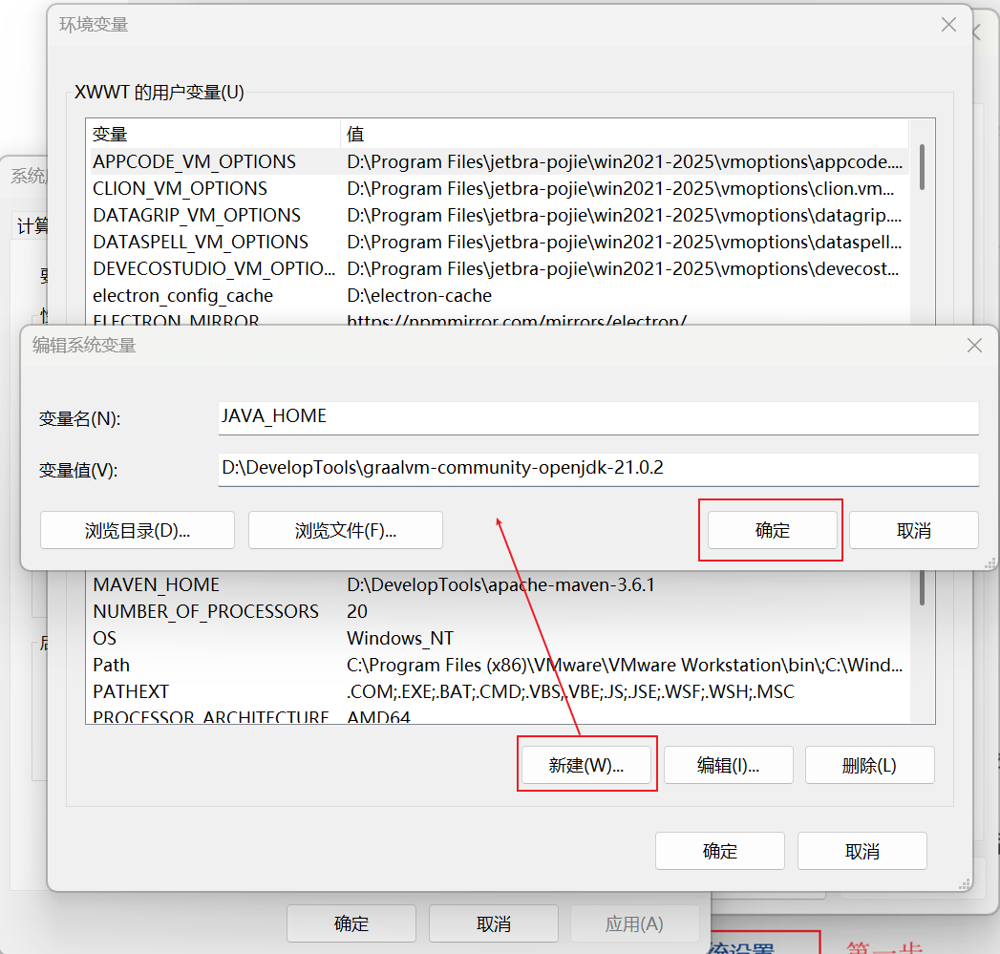
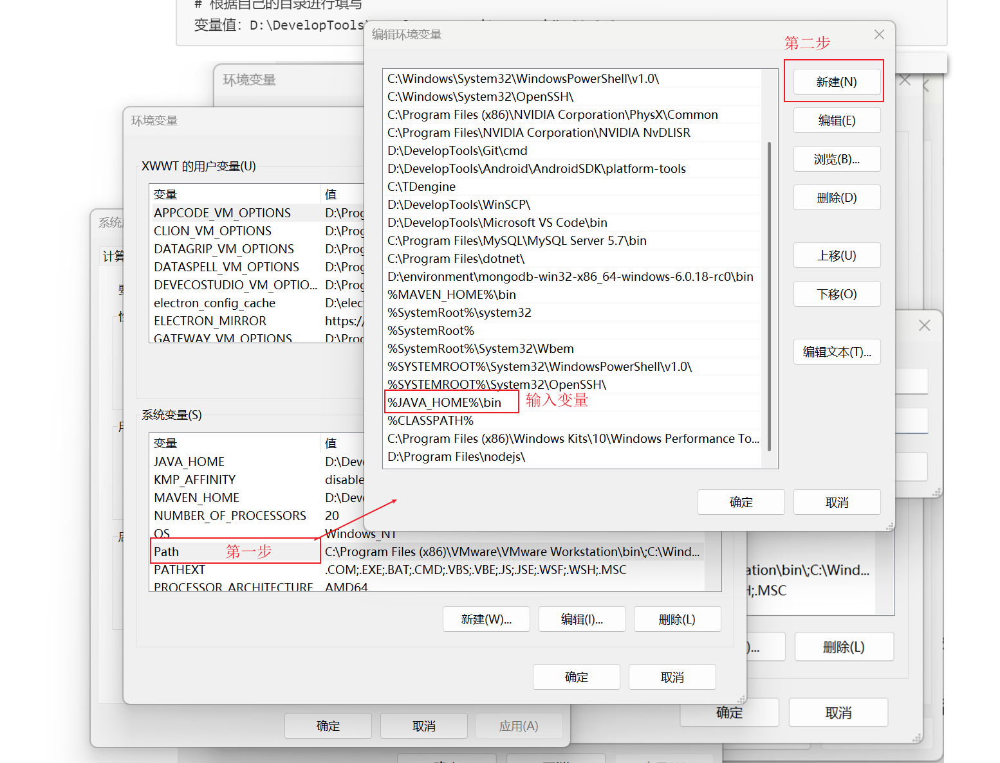
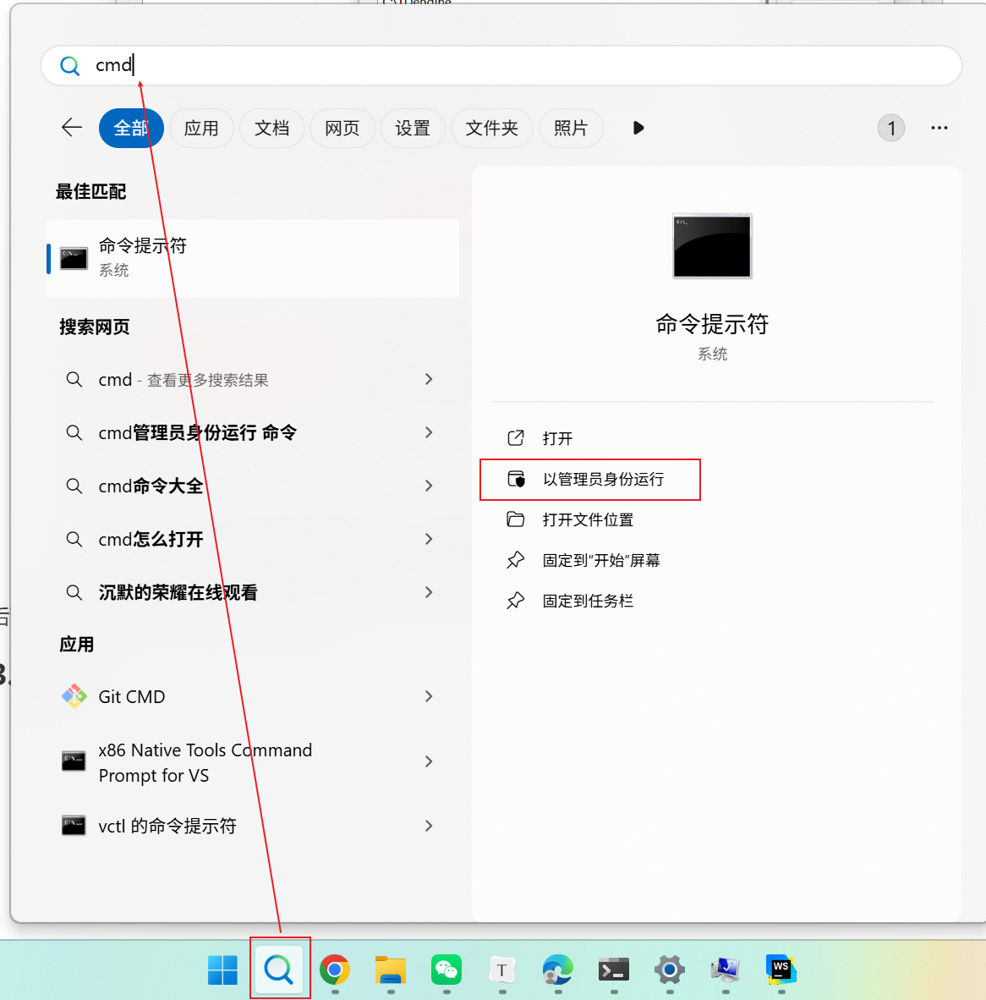
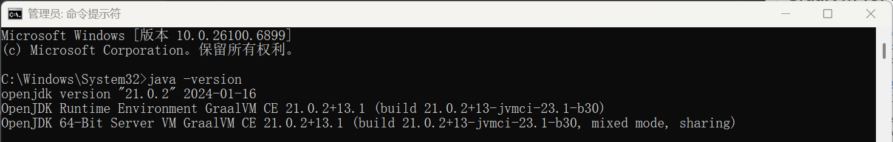
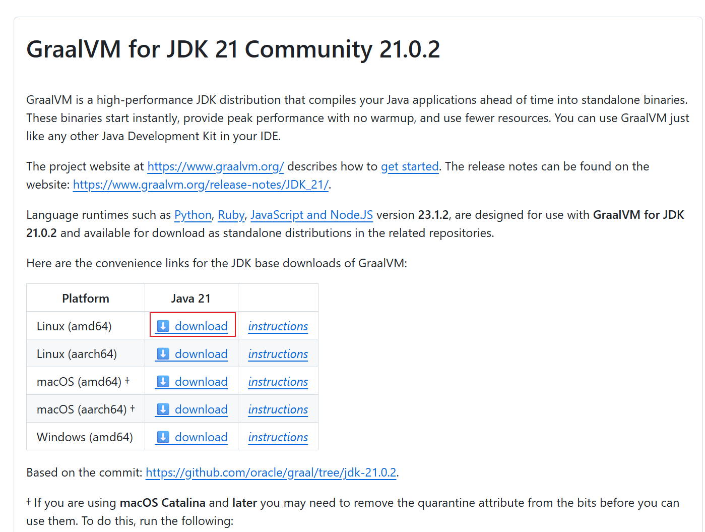

# **Graalvm** 安装指南
#### 下载地址：

- **GraalVM Community Edition（推荐开发环境使用）**: <https://github.com/graalvm/graalvm-ce-builds/releases>

- **Oracle GraalVM（商业版）**: <https://www.oracle.com/java/technologies/downloads/>

> 本文示例使用 **GraalVM CE 21** 版本。

---

## 一、Windows (x64) 安装

### 1. 下载

1. 打开 GraalVM CE GitHub Releases 页面：  
   <https://github.com/graalvm/graalvm-ce-builds/releases>
2. 选择对应版本（这里以 **21.0.2** 为例），下载 Windows x64 的压缩包，例如：  
   `graalvm-community-openjdk-21.0.2_windows-x64_bin.zip`
3. 解压到你习惯的工具目录，例如：D:\DevelopTools\graalvm-community-openjdk-21.0.2

> GraalVM 是免安装的，解压后配置环境变量即可使用。


### 2. 配置环境变量

#### 1. 右键 此电脑（或“我的电脑”） → 属性 → 高级系统设置 → 环境变量



#### 2. 在“系统变量”中新建或编辑 JAVA_HOME：

```text
变量名：JAVA_HOME
# 根据自己的目录进行填写
变量值：D:\DevelopTools\graalvm-community-openjdk-21.0.2
```



#### 3. 在系统变量 Path 中新增一条：

```text
%JAVA_HOME%\bin
```



保存所有窗口完成配置。

### 3. 验证安装

打开 cmd 或 PowerShell，输入：

```bash
java -version
```



如果输出类似如下内容，说明安装成功并已生效：

```bash
java -version

openjdk version "21.0.2" 2024-01-16
OpenJDK Runtime Environment GraalVM CE 21.0.2+13.1 (build 21.0.2+13-jvmci-23.1-b30)
OpenJDK 64-Bit Server VM GraalVM CE 21.0.2+13.1 (build 21.0.2+13-jvmci-23.1-b30, mixed mode, sharing)
```




出现上面的内容，证明 Windows 下 GraalVM 安装成功。
## 一、Linux (amd64) 安装（以 WSL 为例）

> 这里以 Windows 11 下的 WSL（例如 Ubuntu）为示例，其他 Linux 发行版步骤类似。

### 1. 下载

同样在 Windows 浏览器中打开：

https://github.com/graalvm/graalvm-ce-builds/releases

选择 Linux x64 的离线安装包，例如：

```text
graalvm-community-openjdk-21.0.2_linux-x64_bin.tar.gz
```



### 2. 拷贝安装包到wsl系统中
假设你是在 Windows 默认下载目录下载的文件，可以在 WSL 中执行：
```bash
# 1. 拷贝压缩包到当前用户目录
cp /mnt/c/Users/pc/Downloads/graalvm-community-jdk-21.0.2_linux-x64_bin.tar.gz ~/
# 2. 切换到当前用户目录
cd ~
```
### 3. 解压并放到 /opt 目录
```bash
# 1.创建安装目录
mkdir -p /opt/graalvm
# 2.解压到 /opt/graalvm
tar -xzf graalvm-community-openjdk-21.0.2_linux-x64_bin.tar.gz -C /opt/graalvm

# 解压后大致会得到类似目录：
# /opt/graalvm/graalvm-community-openjdk-21.0.2+13.1
```
### 4. 配置环境变量
在当前用户目录下编辑 .bashrc（或者你在用的 shell 对应的配置文件，如 .zshrc）：
```bash
# 编辑 .bashrc：
vim ~/.bashrc
```
在文件末尾追加：
```bash
export GRAALVM_HOME=/opt/graalvm/graalvm-community-openjdk-21.0.2+13.1
export JAVA_HOME=$GRAALVM_HOME
export PATH=$GRAALVM_HOME/bin:$PATH
```
保存后使配置立即生效：
```bash
source ~/.bashrc
```

### 5. 验证安装

```bash
java -version
```
正常情况下会看到类似输出：
```text
root@pc:~# java -version
openjdk version "21.0.2" 2024-01-16
OpenJDK Runtime Environment GraalVM CE 21.0.2+13.1 (build 21.0.2+13-jvmci-23.1-b30)
OpenJDK 64-Bit Server VM GraalVM CE 21.0.2+13.1 (build 21.0.2+13-jvmci-23.1-b30, mixed mode, sharing)

root@pc:~# native-image --version
native-image 21.0.2 2024-01-16
GraalVM Runtime Environment GraalVM CE 21.0.2+13.1 (build 21.0.2+13-jvmci-23.1-b30)
Substrate VM GraalVM CE 21.0.2+13.1 (build 21.0.2+13, serial gc)
```

到这一步，GraalVM 在 Windows 和 Linux（WSL）上就都配置完成了，可以开始体验 native-image 等特性了 🎯

##  Linux 环境小提示

在 Linux / WSL 中使用 GraalVM 进行 **native-image 编译** 时，推荐先安装一些基础工具和库，否则在构建过程中可能会报各种编译 / 链接错误。

执行下面两行命令：

```bash
sudo apt update
sudo apt install -y build-essential zlib1g-dev curl unzip
```

#### 命令说明

- `sudo apt update`
  更新软件源索引，相当于把系统里“可安装的软件列表”刷新一遍。
  这一步不会真正安装任何软件，但通常在 `apt install` 之前都要先做一次。

- `sudo apt install -y build-essential zlib1g-dev curl unzip`
  安装本地编译和常用工具，其中：

  - **build-essential**：一组“基础开发工具合集”，包含 `gcc` / `g++`、`make` 等。

    > GraalVM 的 `native-image` 在生成可执行文件时会调用系统 C/C++ 编译器，这个包是必须的。

  - **zlib1g-dev**：`zlib` 压缩库的开发包，提供编译时需要的头文件和库文件。

    > 一些依赖在 native 编译 / 链接阶段会用到它，缺少时可能会报 `zlib` 相关错误。

  - **curl**：命令行 HTTP 客户端，用来下载文件、调用接口等，很多脚本都会用到。

  - **unzip**：用于解压 `.zip` 压缩包的命令行工具，下载 zip 格式的 SDK / 工具时会用到。

> 简单理解：这两行命令就是“把当前 Linux / WSL 环境变成一个能正常编译 GraalVM Native Image 的基础开发环境”。