#  使用 GraalVM Native Image 打包 Spring Boot 应用（Windows / Linux 全过程）

> 目标：从零创建一个简单的 Spring Boot 项目，在 **Windows / Linux（含 WSL）** 下使用 **GraalVM Native Image** 打包成本机可执行文件，并完成访问测试与简单对比。

## Window 环境准备（必选）

> 在 **Windows 下使用 GraalVM 的 `native-image`** 进行打包时，除了需要 GraalVM 自身，还必须安装一套 **C/C++ 编译工具链**，否则在生成 `.exe` 时会因为找不到编译器或链接器而失败。
>
> 最推荐、也最通用的方式，是安装 **Visual Studio 的 C++ 桌面开发组件**。

### 1. 安装 Visual Studio（推荐方式）

1. 打开 Visual Studio 官网，下载 **Visual Studio Community**（免费版）。  
2. 运行安装程序，在“工作负载”页面勾选：

   - ✅ **使用 C++ 的桌面开发**（Desktop development with C++）

3. 保持默认组件即可，点击安装，等待完成。

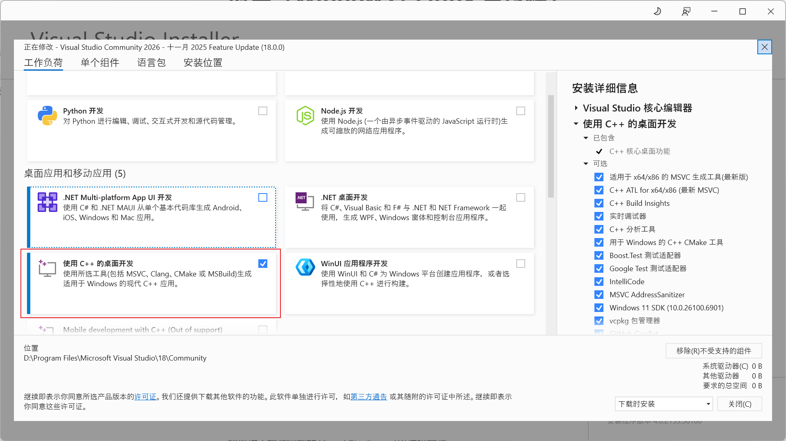

安装完成后，系统中会包含：

- MSVC 编译器（`cl.exe`）
- Windows SDK
- 相关头文件和库文件

这些都是 GraalVM 的 `native-image` 在 Windows 上生成可执行文件时所需要的。

#### 2. 仅安装编译工具（可选：更轻量）

如果你不想装完整的 Visual Studio，可以选择安装：

- **Build Tools for Visual Studio**

在安装界面同样勾选 **“使用 C++ 的桌面开发”** 或类似的 C++ 构建工具选项即可。

#### 3. 如何验证环境是否可用？

安装完成后，可以打开一个 **“x64 Native Tools Command Prompt for VS”**（Visual Studio 安装后会自带），然后执行：

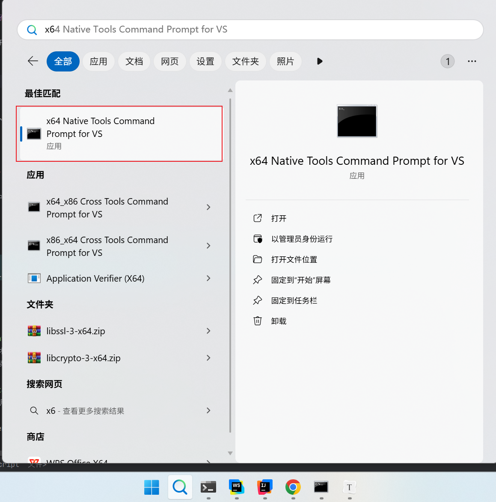

```bash
where cl
```

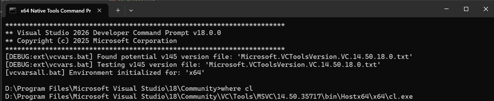

如果看到类似 “Microsoft (R) C/C++ Optimizing Compiler” 的版本信息，就说明 C++ 编译器已经可用，后续在这个环境下跑：

#### 4. 避坑指南

如果其中有"C:\Program Files (x86)\Microsoft Visual Studio\VC98\Bin\CL.EXE"是不对的,可以通过两种方式屏蔽掉.

##### 4.1 直接删除

直接在环境变量(Path)里面删除VC98相关配置.

一般 VS6 相关的路径有几种形式，都可以从 PATH 里删掉（至少开发这类项目时建议删掉）：

```reStructuredText
C:\Program Files (x86)\Microsoft Visual Studio\VC98\Bin

C:\Program Files (x86)\Microsoft Visual Studio\Common\MSDev98\Bin
```

这俩都是 VS 6.0 / 1998 年的工具链，GraalVM 会被它们搞懵。

##### 4.2 临时配置

```bash
D:\Program Files\Microsoft Visual Studio\18\Community>set GRAALVM_HOME=D:\DevelopTools\graalvm-community-openjdk-21.0.2

D:\Program Files\Microsoft Visual Studio\18\Community>set "PATH=%GRAALVM_HOME%\bin;D:\Program Files\Microsoft Visual Studio\18\Community\VC\Tools\MSVC\14.50.35717\bin\Hostx64\x64;%SystemRoot%\system32;%SystemRoot%;%SystemRoot%\System32\Wbem"

D:\Program Files\Microsoft Visual Studio\18\Community>where cl
D:\Program Files\Microsoft Visual Studio\18\Community\VC\Tools\MSVC\14.50.35717\bin\Hostx64\x64\cl.exe
```


## Linux 环境准备（可选，但强烈推荐）

在 Linux / WSL 中使用 GraalVM 进行 **native-image 编译** 时，推荐先安装一些基础工具和库，否则在构建过程中可能会报各种编译 / 链接错误。

执行下面两行命令：

```bash
sudo apt update
sudo apt install -y build-essential zlib1g-dev curl unzip
```

#### 命令说明

- `sudo apt update`
  更新软件源索引，相当于把系统里“可安装的软件列表”刷新一遍。
  这一步不会真正安装任何软件，但通常在 `apt install` 之前都要先做一次。

- `sudo apt install -y build-essential zlib1g-dev curl unzip`
  安装本地编译和常用工具，其中：

  - **build-essential**：一组“基础开发工具合集”，包含 `gcc` / `g++`、`make` 等。

    > GraalVM 的 `native-image` 在生成可执行文件时会调用系统 C/C++ 编译器，这个包是必须的。

  - **zlib1g-dev**：`zlib` 压缩库的开发包，提供编译时需要的头文件和库文件。

    > 一些依赖在 native 编译 / 链接阶段会用到它，缺少时可能会报 `zlib` 相关错误。

  - **curl**：命令行 HTTP 客户端，用来下载文件、调用接口等，很多脚本都会用到。

  - **unzip**：用于解压 `.zip` 压缩包的命令行工具，下载 zip 格式的 SDK / 工具时会用到。

> 简单理解：这两行命令就是“把当前 Linux / WSL 环境变成一个能正常编译 GraalVM Native Image 的基础开发环境”。

## 一、前置条件

### 1. 已安装 GraalVM（JDK 21）

确保你的系统已经安装并配置好 GraalVM（JDK 21 版本），并且 `JAVA_HOME` 和 `PATH` 指向 GraalVM。

**Windows / Linux 都要确认：**

```bash
java -version
native-image --version
```

### 2. 已安装 Maven

确保你的系统已经安装并配置好 Maven。

#### 2.1window

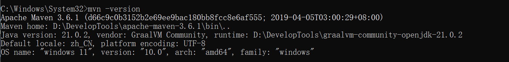

#### 2.2Linux

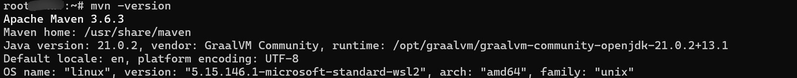

## 二、Springboot项目

> 这里就不过多介绍了

1. 使用 Spring Initializr <https://start.spring.io/>生成项目
2. 使用IntelliJ IDEA 2025.1.1.1创建项目


### 2.1 pom文件

```xml
<?xml version="1.0" encoding="UTF-8"?>
<project xmlns="http://maven.apache.org/POM/4.0.0" xmlns:xsi="http://www.w3.org/2001/XMLSchema-instance"
         xsi:schemaLocation="http://maven.apache.org/POM/4.0.0 https://maven.apache.org/xsd/maven-4.0.0.xsd">
    <modelVersion>4.0.0</modelVersion>

    <!-- ✅ 用 Spring Boot 的 parent，顺带帮你管理插件版本和 native Profile -->
    <parent>
        <groupId>org.springframework.boot</groupId>
        <artifactId>spring-boot-starter-parent</artifactId>
        <version>3.0.2</version>
        <relativePath/>
    </parent>

    <groupId>com</groupId>
    <artifactId>graalvm-sp3</artifactId>
    <version>0.0.1-SNAPSHOT</version>
    <name>graalvm-sp3</name>
    <description>graalvm-sp3</description>

    <properties>
        <java.version>19</java.version>
        <project.build.sourceEncoding>UTF-8</project.build.sourceEncoding>
        <project.reporting.outputEncoding>UTF-8</project.reporting.outputEncoding>
    </properties>


    <dependencies>
        <dependency>
            <groupId>org.springframework.boot</groupId>
            <artifactId>spring-boot-starter-web</artifactId>
        </dependency>

        <dependency>
            <groupId>org.springframework.boot</groupId>
            <artifactId>spring-boot-starter-test</artifactId>
            <scope>test</scope>
        </dependency>
    </dependencies>

    <build>
        <plugins>
            <!-- ✅ GraalVM Native Image Maven 插件：不用写 version 和复杂配置 -->
            <plugin>
                <groupId>org.graalvm.buildtools</groupId>
                <artifactId>native-maven-plugin</artifactId>
                <version>0.10.2</version>
                <configuration>
                    <buildArgs>
                        <!-- 关闭工具链检查，避免 “?? unsupported” 把构建搞挂 -->
                        <buildArg>-H:-CheckToolchain</buildArg>
                    </buildArgs>
                </configuration>
            </plugin>

            <!-- ✅ Spring Boot 插件，指定一下 mainClass 就行 -->
            <plugin>
                <groupId>org.springframework.boot</groupId>
                <artifactId>spring-boot-maven-plugin</artifactId>
                <configuration>
                    <!-- 这里写你的启动类全限定名 -->
                    <mainClass>com.graalvmsp3.GraalvmSp3Application</mainClass>
                </configuration>
            </plugin>

            <!--<plugin>
                <groupId>org.apache.maven.plugins</groupId>
                <artifactId>maven-compiler-plugin</artifactId>
                <version>3.8.1</version>
                <configuration>
                    <source>19</source>
                    <target>19</target>
                    <encoding>UTF-8</encoding>
                </configuration>
            </plugin>
            <plugin>
                <groupId>org.springframework.boot</groupId>
                <artifactId>spring-boot-maven-plugin</artifactId>
                <version>${spring-boot.version}</version>
                <configuration>
                    <mainClass>com.graalvmsp3.GraalvmSp3Application</mainClass>
                    <skip>true</skip>
                </configuration>
                <executions>
                    <execution>
                        <id>repackage</id>
                        <goals>
                            <goal>repackage</goal>
                        </goals>
                    </execution>
                </executions>
            </plugin>-->
        </plugins>
    </build>

</project>
```


## 三、Window下打包

> window下打包的操作需要再**x64 Native Tools Command Prompt for VS**中进行

### 3.1 切换到项目根目录下

保持和**pom.xml**文件在同级目录下

```bash
# 切换到项目根目录
cd D:\Develop\IdeaProjects\graalvm-sp3\graalvm-sp3
```

### 3.2 执行打包指令

如果项目比加大，耗时比较久

```bash
"D:\DevelopTools\apache-maven-3.6.1\bin\mvn.cmd" -Pnative -DskipTests native:compile
```
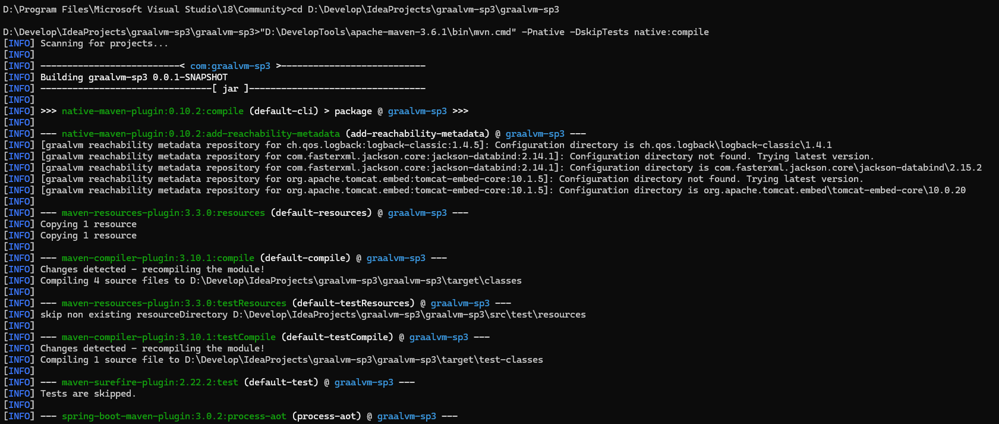
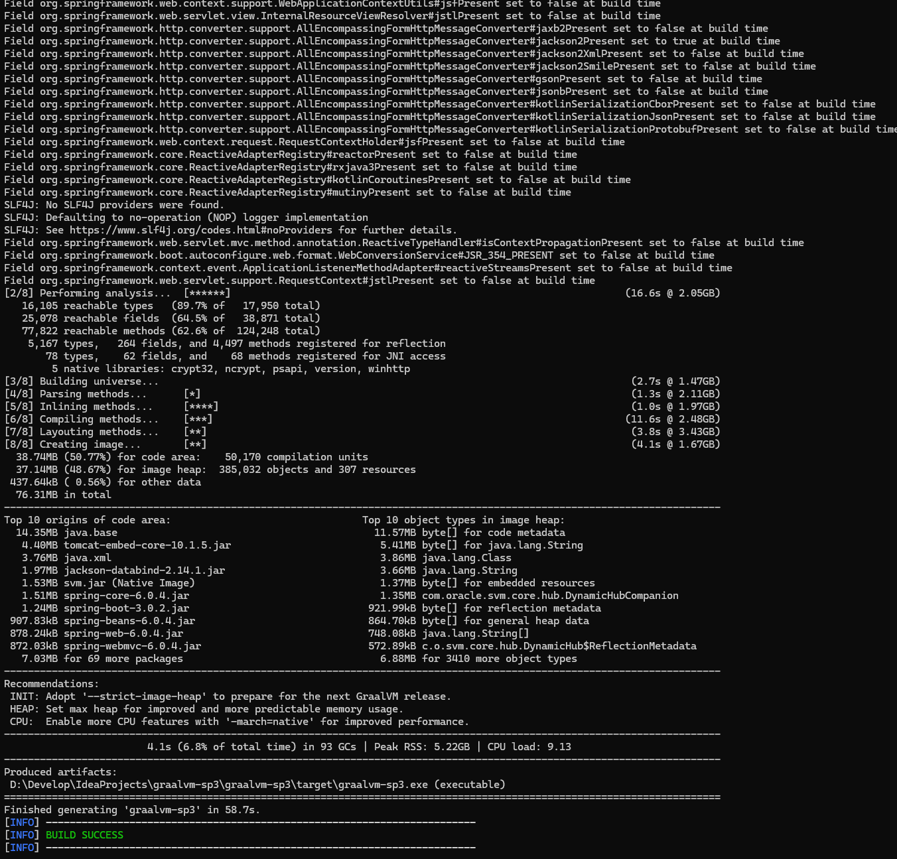

### 3.3 运行测试

```bash
# 切换目录
cd target
# 启动程序1 在cmd下启动
graalvm-sp3.exe
# 启动程序2 双击exe
graalvm-sp3.exe
```

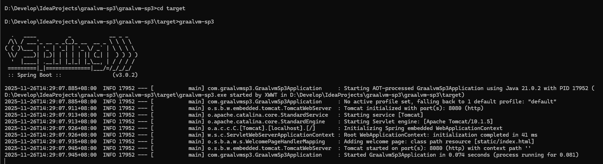

### 3.4 检测程序是否运行正常

> http://127.0.0.1:8080/user/123/roles/222

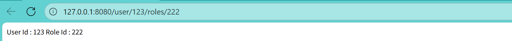

**结束**

## 四、Linux下打包

用 WSL 在 Windows（10/11） 上直接构建 Linux Native Image

####  1. 确认你的 WSL 是 Ubuntu（或其它 Linux）

```bash
wsl -l -v
```

#### 2. 进入 WSL（Linux 环境）

```bash
wsl
```

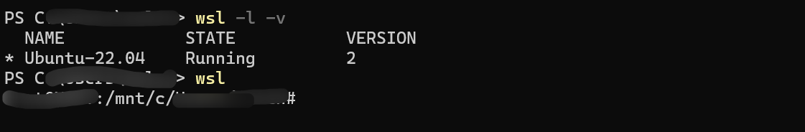

#### 3. 打包

```bash
cd /mnt/d/Develop/IdeaProjects/graalvm-sp3/graalvm-sp3
# 正常流程
mvn -Pnative native:compile
# 跳过测试流程
mvn -Pnative -DskipTests native:compile
```

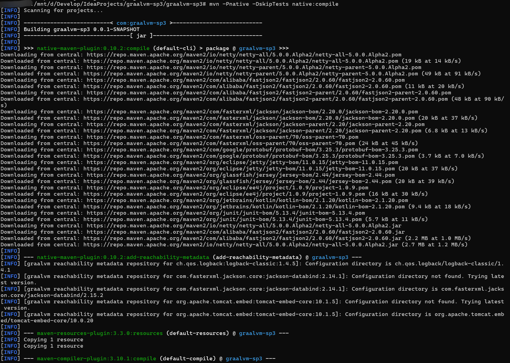
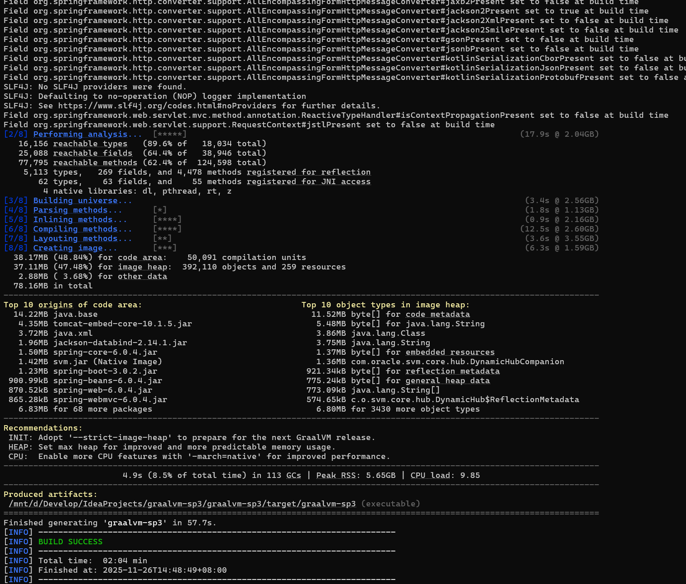

#### 4. 运行程序

```bash
# 切换目录
cd target/

# 增加权限
chmod +x server/graalvm-sp3

# 运行程序
./graalvm-sp3
```

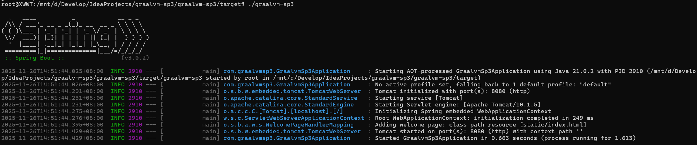

#### 5. 测试

> http://172.31.99.111:8080/user/123/roles/222

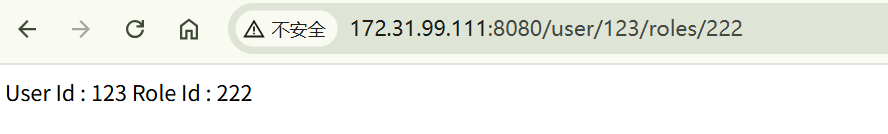


**结束**
